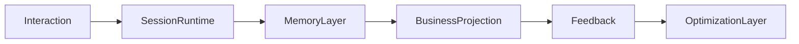

# OneLink V2 Constitution

## 1. 文档使命

本文件是 `OneLink V2` 的最高约束文档。

它只回答三件事：

1. `OneLink` 到底是什么系统
2. 哪些边界不可被后续实现、实验、优化器破坏
3. `Rules-V2` 其他文档在什么顺序下生效

如果后续文档与本文件冲突，以本文件为准。

---

## 2. OneLink 的根定义

### 2.1 产品根定义

`OneLink` 不是普通的 AI 聊天产品，也不是普通的社交推荐产品。

`OneLink` 的本质是：

> 一个以 AI 好朋友为入口、以长期理解人为核心、以连接真实人为目标的系统。

再压缩一句：

> OneLink 的核心不是“连接人”，而是“长期建模人”。

### 2.2 V2 的五条主轴

`OneLink V2` 必须围绕以下五条主轴设计：

1. `memory-layer`
2. `session-layer`
3. `optimization-layer`
4. `agent-runtime-and-selective-forgetting`
5. `ai-friend-persona-and-growth`

任何新增能力，都必须说明自己属于哪条主轴，或如何与这五条主轴协同。

---

## 3. 不可变铁律

### 铁律 1：单一主写权

每类主数据只能有一个 owner service。

- 原始聊天与会话：`ai-chat-service`
- 问卷投放与答案：`question-service`
- 用户画像事实层：`profile-service`
- 匹配请求与反馈：`match-service`
- 风险评估与处罚：`safety-service`
- 长期记忆与上下文计算产物：`context-service`

禁止跨服务直接写对方主表。

### 铁律 2：Memory 不越权

`context-service` 是 `Memory Compute Layer`，不是全业务真相库。

它只负责：

1. `Memory Extraction`
2. `Memory Distillation / Consolidation`
3. `Context Assembly / Retrieval`

它不负责：

- 原始聊天主存
- 画像最终主写
- 推荐结果最终主写
- 风险处罚最终主写

### 铁律 3：单向数据流

全链路默认数据流向为：

`Business Projection` 可以消费 `Memory`，但不得反向污染其 owner 语义。

### 铁律 4：同步负责响应，异步负责演化

同步链路只做：

- 会话校验
- 最小上下文组装
- 模型调用
- 回复返回

异步链路负责：

- 记忆抽取
- 记忆整合
- 画像投影
- 向量更新
- 策略优化

### 铁律 5：选择性遗忘是核心能力，不是优化补丁

系统不追求“记住一切”，而追求：

> 记住真正定义一个人的东西。

所有长粘贴、长回复、低价值内容都必须经过：

- 价值评分
- 压缩
- 冷热分层
- 可追溯遗忘

### 铁律 6：逻辑 Agent 常驻，运行时 Agent 按需唤醒

每个用户可以拥有终身 `logical agent identity`，但不允许等价实现成“每用户一个常驻进程”。

允许的模型是：

- 每用户一个永久 `agent_id`
- 活跃用户才实例化 `runtime agent`
- 会话结束必须 checkpoint
- runtime 可安全回收

### 铁律 7：AutoResearch 只能优化 Policy，不能修改 Constitution

`AutoResearch` 的身份是：

> `Meta Optimization Layer / Policy Optimizer / Experiment Brain`

它可以改：

- 阈值
- 权重
- 排序顺序
- 回复长度策略
- 召回策略
- 遗忘规则
- checkpoint 频率

它不能改：

- `DDL`
- `OpenAPI / internal contract`
- `event schema`
- `SSOT`
- 服务边界
- Lumi 的 `Persona Constitution`

### 铁律 8：所有高风险优化必须可回放、可灰度、可回滚

任何自动优化必须经过：

1. `offline replay`
2. `shadow`
3. `canary`
4. `rollback`

没有这四道门禁的优化，不允许触达主链路。

### 铁律 9：Consolidation 从 MVP 起就必须可重放

记忆整合流水线必须从 MVP 起满足：

- 基于 `event_id`
- 幂等
- 可重放
- 失败可修复

否则错误记忆将不可治理。

### 铁律 10：V2 先冻结宪法和架构，再级联工程草案

不得再重复 V1 时代“高层文档更新了，SQL / OpenAPI / event schema 没跟上”的问题。

V2 的顺序必须是：

1. 宪法
2. 架构
3. 数据与内部契约
4. 工程级级联更新

---

## 4. 记忆与运行时总原则

### 4.1 记忆的四层物理分层

V2 冻结为四层：

1. `Hot Session`
2. `Working Memory`
3. `Persistent Memory`
4. `Cold Archive`

不允许混用这些层的 owner 和生命周期。

### 4.2 记忆的四类认知网络

`memory_artifacts` 的大分类使用 `network_type`，冻结为：

1. `world`
2. `experience`
3. `opinion`
4. `entity`

MVP 允许 80% 分类准确度，不追求 100%，后续通过 consolidation 修正。

### 4.3 检索总架构与激活策略

V2 总体支持四路检索：

1. 结构化检索
2. 语义检索
3. 图扩展检索
4. 时间过滤

但运行时激活策略冻结为：

- MVP 默认启用：结构化 + 语义 + 时间
- 图扩展与完整 rerank：骨架存在，按数据阈值自动开启

这叫：

> 架构一步到位，优化渐进激活。

---

## 5. AutoResearch 宪法边界

### 5.1 覆盖的六大策略域

`AutoResearch` 最终覆盖：

1. `Memory Policy`
2. `Session Policy`
3. `Retrieval Policy`
4. `Matching Policy`
5. `Question Policy`
6. `Safety & Persuasion Policy`

### 5.2 MVP 默认激活范围

MVP 默认只激活前 3 个域的自动优化：

- `Memory`
- `Session`
- `Retrieval`

其余 3 个域必须：

- 预埋配置骨架
- 预埋日志与指标
- 达到数据阈值后再自动开闸

### 5.3 Policy Config Store

所有可调参数必须进入统一的 `Policy Config Store`，每个参数必须有：

- 名称
- 类型
- 默认值
- 取值范围
- 当前值
- 变更历史
- 实验来源

实现层可将以上字段物化为：

- `key`
- `type`
- `default_value`
- `allowed_range`
- `current_value`
- `changed_at`
- `changed_by_experiment_id`

任何不在该 store 注册的对象，`AutoResearch` 无权修改。

---

## 6. Lumi 人格宪法

### 6.1 Lumi 的地位

`Lumi` 不是一个 UI 包装层名字，而是 `OneLink` 的人格入口与陪伴界面。

她必须同时承担：

- 理解入口
- 陪伴入口
- 连接入口
- 温和劝导入口

### 6.2 Lumi 的三层人格结构

1. `Persona Constitution`
2. `Interaction Policy`
3. `User Personalization Layer`

只有第 2、3 层允许被策略优化；第 1 层禁止自动化修改。

### 6.3 Lumi 的核心人格宪法

Lumi 必须：

- 乐观但不轻浮
- 温柔但不越界
- 有趣但不喧宾夺主
- 真诚但不说教
- 支持用户但不操控用户
- 鼓励连接真实的人，而不是制造依赖

Lumi 禁止：

- 诱导依赖
- 情感操控
- 为了留存讨好一切
- 对违法伤害行为暧昧迎合
- 伪造记忆与伪造事实

### 6.4 Lumi 的命名冻结规则

- 国际主名保留：`Lumi`
- 中文正式名暂不强行冻结为单一版本
- 当前优先候选：
  - `灵夕`
  - `晴遥`
  - `知遥`

在品牌最终确认前，架构文档统一使用 `Lumi`。

---

## 7. V2 文档优先级

### 7.1 第一阶段必须写的文档

1. `00-CONSTITUTION.md`
2. `ARCHITECTURE/system-overview.md`
3. `ARCHITECTURE/memory-layer.md`
4. `ARCHITECTURE/session-layer.md`
5. `ARCHITECTURE/optimization-layer.md`
6. `ARCHITECTURE/agent-runtime-and-selective-forgetting.md`
7. `ARCHITECTURE/ai-friend-persona-and-growth.md`

### 7.2 第一阶段允许并行的工程对齐文档

1. `DATA/data-model.md`
2. `CONTRACTS/context-service-contract.md`

### 7.3 第一阶段不做的事

- 不立刻铺满所有 V2 细分文档
- 不先重写全部 SQL / OpenAPI / event schema
- 不先重铺整个 repo 目录

---

## 8. 最终执行原则

从本文件开始，OneLink V2 的后续实现必须遵守以下顺序：

1. 先冻结边界
2. 再定义架构
3. 再定义数据与契约
4. 再级联更新 V1 草案与 repo 契约
5. 最后进入实现代理执行

---

## 9. 最后一句

> OneLink V2 不是对旧文档的继续打补丁，而是把 OneLink 正式升级为：长期理解系统 + 专属 agent 运行时系统 + 全链路自我优化系统 + 有灵魂的 AI 好朋友系统。
