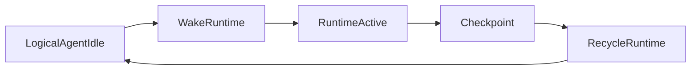

# OneLink V2 Agent Runtime And Selective Forgetting

## 1. 文档目标

定义 `每用户一个终身逻辑 agent`、`runtime 按需唤醒`、`无限画布` 与 `选择性遗忘` 的实现原则。

---

## 2. 核心结论

OneLink 可以实现：

- 每个用户一个专属逻辑 agent
- 终身会话时间线
- 无限可回看画布

但不追求：

- 每用户一个常驻进程
- 每次推理加载全部历史
- 记住所有原文

一句话：

> 逻辑 agent 常驻，运行时 agent 按需唤醒；画布无限，实时上下文有限。

---

## 3. 逻辑 Agent 与运行时 Agent

### 3.1 `Logical Agent`

长期存在，至少包含：

- `agent_id`
- `user_id`
- 历史时间线索引
- 工作记忆引用
- 持久记忆引用
- checkpoint 引用

### 3.2 `Runtime Agent`

只在用户活跃期间存在，负责：

- 当前上下文装配
- 当前模型调用编排
- 会话状态推进
- 本次事件发射

### 3.3 生命周期



---

## 4. Agent State 版本化

### 4.1 必须包含 `schema_version`

所有 checkpoint 与 runtime state 持久化对象都必须有：

- `schema_version`
- `created_at`
- `migrated_from_version`（如适用）

### 4.2 迁移原则

系统必须支持：

- 新版本 runtime 读取旧 checkpoint
- 唤醒时自动迁移到最新结构
- 不需要一次性全量改写全部历史状态

### 4.3 编码建议

V2 目标格式为高效序列化对象，优先考虑：

- `protobuf`
- `flatbuffers`

---

## 5. Selective Forgetting Engine

### 5.1 为什么必须有

因为 OneLink 不是要赢在“谁保留更多原文”，而是赢在：

- 谁更会提炼与压缩
- 谁更会保留高价值认知
- 谁更少被噪音污染

### 5.2 输入分类

系统至少将内容分为四类：

#### A. 高价值画像内容

长期保留。

#### B. 中价值会话内容

保留摘要，不默认保留全文到热层。

#### C. 低价值长粘贴 / 外部资料

只保留：

- 摘要
- 指纹
- 冷存储引用

#### D. 通用知识问答

默认不长期记回答全文，只保留兴趣或困惑信号。

---

## 6. 记忆价值评分

建议统一使用 `memory_value_score` 概念。

示意公式：

```text
MemoryValueScore =
0.35 * profile_relevance +
0.20 * relationship_relevance +
0.15 * future_matching_value +
0.10 * novelty +
0.10 * emotional_signal +
0.10 * user_declared_importance
```

### 6.1 分层策略

- `>= high_threshold`：长期保留
- `mid_threshold ~ high_threshold`：摘要保留
- `low_threshold ~ mid_threshold`：只留统计信号和冷存储引用
- `< low_threshold`：可遗忘

---

## 7. 遗忘必须可追溯

### 7.1 必须记录

- 被遗忘对象 ID
- 原文冷存储引用
- 遗忘决策理由
- 决策时间
- 生效 policy 版本

### 7.2 不允许的做法

- 无日志直接删除热层与冷层原文
- 无法证明为什么遗忘
- 因系统升级而丢失遗忘历史

---

## 8. 用户主动保留能力

系统必须支持用户显式表达：

- “这个很重要”
- “别忘了这个”

这会直接提高：

- `user_declared_importance`
- 保留优先级

MVP 可以先做最小交互，不要求复杂 UI。

---

## 9. 冷热分层策略

### 9.1 热层

只保留：

- 当前请求必要上下文
- 最近工作摘要
- 高频命中的少量长期记忆

### 9.2 冷层

保留：

- 原始聊天全文
- 长粘贴原文
- 低价值旧消息
- 历史运行状态归档

### 9.3 原则

热层用于低延迟；冷层用于可追溯与按需回放。

---

## 10. 唤醒预算

每次 runtime 唤醒都必须有预算概念：

- `wakeup_state_budget`
- `max_context_budget`
- `cold_replay_budget`

不得在每次唤醒时无条件把长期历史整包加载。

---

## 11. 与 AutoResearch 的关系

`AutoResearch` 可以优化：

- 保留阈值
- 长粘贴压缩比例
- runtime ttl
- checkpoint 频率
- 唤醒状态大小

但不能取消：

- 遗忘审计
- checkpoint 版本化
- 用户可标记重要

---

## 12. 一句话定义

> Agent Runtime And Selective Forgetting 负责把“每人一个终身 agent”变成可规模化、可控成本、可持续演进的现实系统。
