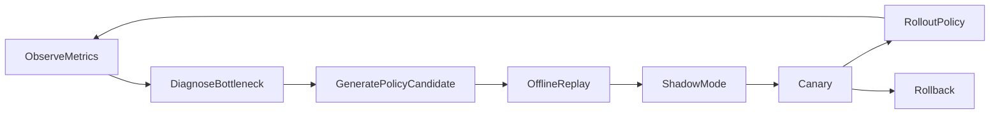

# OneLink V2 Optimization Layer

## 1. 文档目标

定义 `AutoResearch` 在 OneLink V2 中的最终位置、权限边界、实验闭环与六大策略域。

---

## 2. 最终定位

`AutoResearch` 在 V2 中不再是一个研究灵感，而是：

> `Meta Optimization Layer / Policy Optimizer / Experiment Brain`

它的工作不是直接生成用户响应，而是持续优化整条系统链路中的策略参数。

---

## 3. 它优化什么

### 3.1 六大策略域

1. `Memory Policy`
2. `Session Policy`
3. `Retrieval Policy`
4. `Matching Policy`
5. `Question Policy`
6. `Safety & Persuasion Policy`

### 3.2 每个策略域的目标

#### `Memory Policy`

- 记什么
- 忘什么
- 长粘贴如何压缩
- 什么只留摘要

#### `Session Policy`

- 上下文预算
- 摘要频率
- runtime ttl
- 默认回复长度

#### `Retrieval Policy`

- 先查什么
- 召回几条
- 什么时候降级
- 什么时候启用 rerank

#### `Matching Policy`

- 召回路径
- 特征权重
- 多样性
- 负反馈处理

#### `Question Policy`

- 该问什么
- 何时问
- 追问深度
- 哪些题最有助于画像收敛

#### `Safety & Persuasion Policy`

- 风险阈值
- 劝导话术
- 拒绝方式
- 澄清策略

---

## 4. 它不优化什么

`AutoResearch` 禁止自动修改：

- `DDL`
- 服务边界
- `OpenAPI / internal contract`
- `event schema`
- 主写 owner 归属
- 合规与伦理底线
- Lumi 的 `Persona Constitution`

一句话：

> 它优化的是 `policy`，不是 `constitution`。

---

## 5. 数据平面与控制平面边界

### 5.1 数据平面

负责真实用户请求。

### 5.2 控制平面

负责：

- 观察日志与指标
- 形成假设
- 生成策略候选
- 做 replay / shadow / canary
- 写入 `Policy Config Store`

### 5.3 核心原则

控制平面不得直接插入在线主链路。

---

## 6. 标准优化闭环



---

## 7. Policy Config Store

所有可调参数必须进入统一的 `Policy Config Store`。

### 7.1 每个参数至少包含

- `key`
- `domain`
- `type`
- `default_value`
- `allowed_range`
- `current_value`
- `changed_by_experiment_id`
- `changed_at`

### 7.2 在线服务的行为

在线服务只读取配置中心中的当前生效值，不接受优化器的直接代码注入。

---

## 8. MVP 与后续激活策略

### 8.1 MVP 默认激活的自动优化域

- `Memory Policy`
- `Session Policy`
- `Retrieval Policy`

### 8.2 MVP 预埋但默认不主动优化的域

- `Matching Policy`
- `Question Policy`
- `Safety & Persuasion Policy`

### 8.3 激活机制

通过 `policy_activation_gate` 自动控制。

示意：

```text
if matching_feedback_count >= threshold:
  enable(matching_policy)

if question_answer_count >= threshold:
  enable(question_policy)

if safety_case_count >= threshold:
  enable(safety_policy)
```

---

## 9. 核心指标体系

### 9.1 北极星指标

- 用户满意度
- 匹配成功率
- 有效连接率
- 长期留存

### 9.2 系统效率指标

- 上下文拼装时间
- prompt 利用率
- 模型调用成本
- 内存占用
- 唤醒状态体积

### 9.3 策略质量指标

- 高价值记忆命中率
- 误遗忘率
- 误保留率
- 画像收敛速度
- 错误召回率

---

## 10. 高风险域的额外门禁

以下策略域默认属于高风险优化：

- `Matching`
- `Safety & Persuasion`
- `persona-related interaction policy`

这些域必须增加：

- 人工审批开关
- 更严格的 canary 比例
- 自动回滚红线

---

## 11. 与 Lumi 的边界

`AutoResearch` 可以优化：

- 幽默强度
- 回复长度
- 追问频率
- 情绪表达细腻度
- 劝导策略模板的使用权重

但不能优化：

- Lumi 的使命
- Lumi 的价值观
- Lumi 的反操控底线

---

## 12. 一句话定义

> Optimization Layer 不是在线回答系统，而是让 OneLink 越来越会记、越来越会忘、越来越会召回、越来越会连接人的控制平面。
