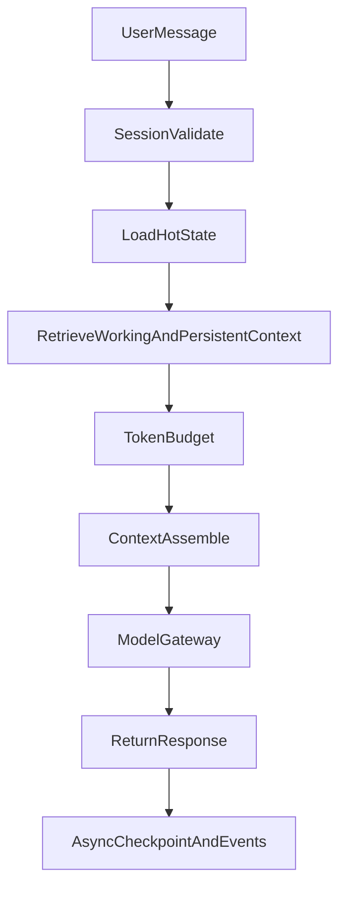

# OneLink V2 Session Layer

## 1. 文档目标

定义 `session-layer` 如何管理会话、上下文窗口、工作记忆、检查点与回复主链路。

---

## 2. Session Layer 的职责

`session-layer` 负责：

1. 维护有限上下文窗口
2. 管理工作记忆与近期摘要
3. 装配单次请求需要的上下文包
4. 管理会话 checkpoint
5. 连接 `logical agent` 与单次运行时

它不负责：

- 长期记忆主存
- 画像主写
- 推荐主写
- 风险处罚主写

---

## 3. 无限画布的正确定义

### 3.1 用户感知层

用户看到的是：

- 一个可以长期继续的会话
- 能回看过去
- 能跨月跨年继续

### 3.2 推理层

模型实际看到的是：

- 一个有限的、动态装配的上下文窗口

因此：

> 无限画布 = 无限事件时间线 + 有限实时上下文窗口。

---

## 4. 四层会话相关存储

### 4.1 `Hot Session`

承载当前请求所需的最小状态。

建议存放：

- 进程内短时状态
- Redis 热缓存

### 4.2 `Working Memory`

承载当前会话与近期阶段最重要的摘要。

建议存放：

- Redis
- `memory_summaries`

### 4.3 `Persistent Memory`

由 `memory-layer` 维护，承接长期认知。

### 4.4 `Cold Archive`

承载：

- 原始消息全文
- 长粘贴原文
- 已从热层移除的低价值内容

---

## 5. 会话主链路

---

## 6. Context Window 策略

### 6.1 必须包含

- 当前用户输入
- 最近若干轮关键对话
- 最近 `memory_summaries`
- 高置信度长期记忆 Top-K

### 6.2 必须受限

所有请求必须显式受以下参数控制：

- `max_tokens`
- `memory_limit`
- `summary_limit`
- `reply_style`

### 6.3 不允许的做法

- 把所有原始聊天无上限拼接进 prompt
- 把冷存储全文默认召回进热层
- 因为用户发长文就整体放大上下文预算

---

## 7. 会话摘要策略

### 7.1 目标

摘要不是为了替代长期记忆，而是为了：

- 稳定工作上下文
- 控制 token
- 提高上下文命中率

### 7.2 MVP 摘要策略

MVP 支持：

1. `compact`
2. `sliding-window`
3. 简化版 `self-summarizer`

### 7.3 触发条件

- 消息数达到阈值
- 主题发生切换
- 出现高价值片段
- 会话进入休眠前

---

## 8. Checkpoint 机制

### 8.1 为什么必须做

因为 `logical agent` 不能常驻内存，runtime 必须随时可以回收。

### 8.2 Checkpoint 至少包含

- `agent_id`
- `user_id`
- `conversation_id`
- `schema_version`
- `working_summary_ref`
- `selected_policy_versions`
- `runtime_state_blob`
- `created_at`

### 8.3 版本化要求

所有 checkpoint 都必须有 `schema_version`。

运行时恢复时必须支持：

- 读取旧版本 checkpoint
- 自动 migration 到当前版本
- 不要求批量重写全部历史 checkpoint

### 8.4 编码格式要求

MVP 可以先保留可读性更强的编码，但 V2 明确要求未来迁移到更高效的二进制格式，例如：

- `protobuf`
- `flatbuffers`

不建议长期使用松散 JSON 作为海量 checkpoint 的最终格式。

---

## 9. Session Policy

`session-layer` 的可调策略包括：

- `max_tokens`
- `summary_limit`
- `memory_limit`
- `reply_style`
- `checkpoint_interval`
- `runtime_ttl`
- `wakeup_state_budget`

这些参数必须进入 `Policy Config Store`，由 `AutoResearch` 在宪法边界内优化。

---

## 10. 输出策略

### 10.1 默认原则

默认短答、自然、有效，不追求“最长解释”。

### 10.2 三档回复策略

- `brief`
- `balanced`
- `deep`

MVP 默认：

- 主会话用 `brief / balanced`
- `deep` 仅在用户显式请求或特定任务场景启用

### 10.3 产品意义

短答策略不是能力不足，而是：

- 降低成本
- 降低上下文污染
- 把重点放回“理解用户和连接用户”

---

## 11. 与 Agent Runtime 的边界

`session-layer` 与 `agent-runtime` 密切关联，但职责不同：

- `session-layer`：管理本次会话需要的上下文
- `agent-runtime`：管理用户长期 agent 身份与唤醒/休眠

---

## 12. 一句话定义

> Session Layer 负责把“无限时间线”压缩成“单次推理真正需要的有限上下文”。
