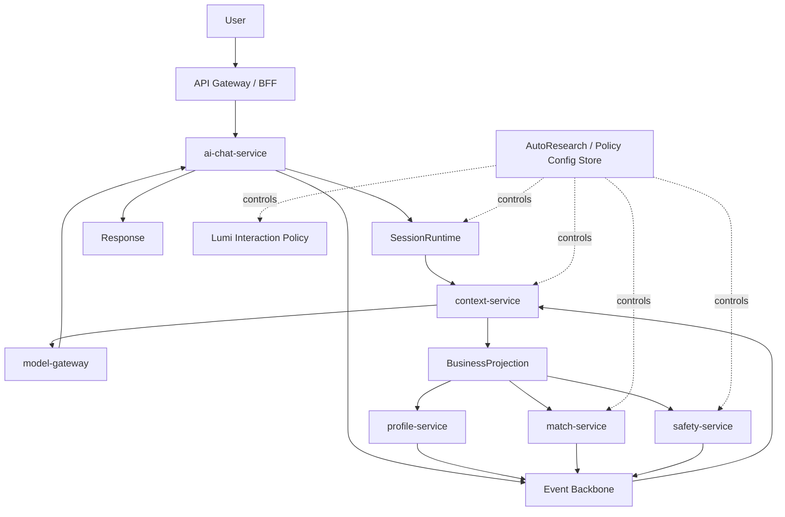

# OneLink V2 System Overview

## 1. 文档目标

本文件定义 `OneLink V2` 的系统总览、五条主轴之间的关系、在线主链路与离线控制平面的边界。

它回答：

1. 整个系统是如何分层的
2. 哪些层是数据平面，哪些层是控制平面
3. 五条主轴如何一起构成 OneLink

---

## 2. 系统总定义

`OneLink V2` 是一个由 AI 好朋友驱动的长期理解与连接系统。

它的目标不是生成最长的回答，而是用尽量低的成本做到：

- 更快理解用户是谁
- 更稳定维护长期记忆
- 更准确完成人与人的连接
- 更温和处理风险与边界

---

## 3. 五条主轴

### 3.1 `memory-layer`

负责长期认知记忆的抽取、整合、检索与投影候选。

### 3.2 `session-layer`

负责有限上下文窗口内的会话管理、工作记忆、上下文装配与回复主链路。

### 3.3 `optimization-layer`

负责全链路 policy 的离线/准离线优化，是控制平面，不直接插入主回复链路。

### 3.4 `agent-runtime-and-selective-forgetting`

负责每用户逻辑 agent、runtime 唤醒/休眠、无限画布、选择性遗忘与冷热分层。

### 3.5 `ai-friend-persona-and-growth`

负责 Lumi 的人格宪法、互动策略、用户个性化与受约束成长。

---

## 4. 总体结构

---

## 5. 数据平面与控制平面

### 5.1 数据平面

数据平面负责实际处理用户请求。

包括：

- `api-gateway / bff`
- `ai-chat-service`
- `context-service`
- `model-gateway`
- `profile-service`
- `match-service`
- `safety-service`

### 5.2 控制平面

控制平面负责策略更新，不直接处理用户实时请求。

包括：

- `AutoResearch`
- `Policy Config Store`
- `Experiment Runner`
- `Replay / Shadow / Canary / Rollback` 门禁

### 5.3 边界规则

控制平面只能通过配置影响数据平面，不能直接：

- 改代码
- 改表结构
- 改事件 schema
- 改 Lumi 宪法

---

## 6. 在线主链路

### 6.1 标准聊天主链路

1. 用户请求进入 `api-gateway / bff`
2. `ai-chat-service` 校验用户与会话
3. `ai-chat-service` 调用 `context-service`
4. `context-service` 读取 working / persistent memory，执行检索与 token budget 控制
5. `model-gateway` 统一调用模型能力
6. `ai-chat-service` 融合结果并返回响应
7. 事件异步发往 `Event Backbone`
8. 后续演化由记忆、画像、匹配、安全异步消费

### 6.2 标准连接主链路

1. 用户表达找人意图
2. `match-service` 结合结构化画像、长期记忆信号与安全约束构造候选
3. 名片返回
4. 曝光、点击、关注、私信、举报等反馈进入事件总线
5. 反馈反哺 `memory-layer` 与 `optimization-layer`

---

## 7. 无限画布的正确定义

`OneLink` 支持：

- 无限时间线
- 无限历史可回看
- 终身逻辑会话

但不支持：

- 把全部历史 token 永久装进单次 prompt

因此系统定义为：

> UI 层无限，推理层有限。

---

## 8. V2 与 V1 的关系

### 8.1 保留项

V1 中以下核心判断继续保留：

- Rust 作为在线服务主语言
- `context-service` 作为记忆计算层
- `model-gateway` 统一模型能力
- `profile-service` 继续拥有画像主写权
- `PostgreSQL + Redis + Qdrant + Kafka` 作为 MVP 基础技术栈

### 8.2 升级项

V2 明确升级：

- `context-service` 从“长期记忆模块”升级为双域系统：`memory domain + session domain`
- `AutoResearch` 从实验理念升级为 `Meta Optimization Layer`
- 引入 `logical agent runtime`
- 引入 `selective forgetting`
- 引入 Lumi 人格宪法

---

## 9. 架构一步到位，优化渐进激活

### 9.1 一步到位的部分

MVP 就必须有：

- 六大策略域的配置骨架
- 四路检索的总架构
- `memory_entities / memory_entity_links` 数据模型
- agent checkpoint 的版本化能力
- 冷热分层与遗忘审计能力

### 9.2 渐进激活的部分

MVP 默认激活：

- `Memory Policy`
- `Session Policy`
- `Retrieval Policy`

以下能力在数据达到阈值后自动开闸：

- `Matching Policy`
- `Question Policy`
- `Safety & Persuasion Policy`
- 图扩展检索
- 完整 rerank

---

## 10. 北极星

V2 的最终目标不是做出一个“更能说”的模型壳，而是做出一个：

> 比别人更会理解用户、记住关键、忘掉噪音、帮助连接真实人的系统。
