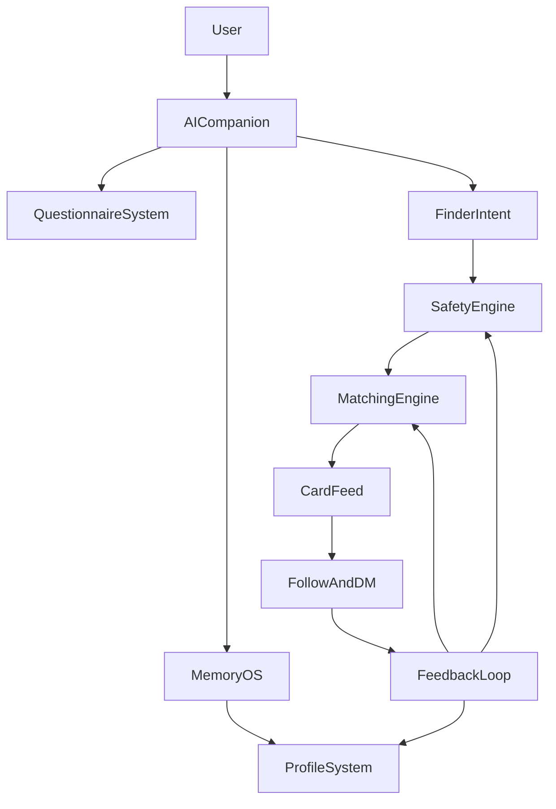

# OneLink Executive Blueprint

## 1. 项目定义

### 1.1 官方定位
- 产品名：`OneLink`
- 中文名：`一度相连`
- 理论名：`One-Degree Network`
- 核心承诺：用户只需要认识一个 AI 好朋友，就能在安全、合规、可解释的前提下，更高效地连接平台内最合适的人。

### 1.2 愿景与边界
- 长期愿景：成为全球范围内以 AI 为中介的连接基础设施。
- 当前产品边界：`OneLink` 只匹配平台内已经注册、授权、可被推荐的用户，不承诺“直接找到现实世界任意一个未注册的人”。
- 差异化：不做全网人肉搜索，不抓取未经同意的个人隐私数据，核心资产来自用户与 AI 的授权对话、问卷和平台内行为反馈。

### 1.3 北极星目标
- 对用户：更快找到真正有帮助、愿意回应、适合建立关系的人。
- 对平台：在保证安全和隐私的前提下，让“找人成功率”和“有效连接率”持续提升。
- 对技术：从第一天开始就采用可替换模型、可扩展服务和可审计数据链路，确保以后自研模型时不需要推倒重来。

## 2. 核心原则

### 2.1 产品原则
- `AI 先做理解，再做连接`：先理解用户是谁、需要什么、愿意提供什么，再做推荐。
- `安全先于增长`：不为了提高匹配量牺牲隐私、反骚扰和合规性。
- `渐进式承诺`：面向 70 亿人的架构目标先在系统边界上成立，再按阶段扩容，不搞一开始就无法落地的空中楼阁。
- `默认可解释`：画像更新、推荐结果、处罚动作都必须可追溯到规则、模型和事件。

### 2.2 技术原则
- `接口稳定，内部可替换`：业务服务不直接依赖某一个外部大模型，而是统一走模型网关。
- `在线轻量，离线增强`：复杂画像更新、实验训练、模型迭代主要放在离线与异步链路，核心交互链路保持低延迟。
- `分层存储`：事务、检索、向量、消息、对象分别治理，避免单库做所有事情。
- `隐私最小化`：只采集完成业务所必需的数据，所有高风险字段都走显式同意和访问审计。

## 3. 统一文档地图

以下文档构成 OneLink 的唯一执行规范：

1. `00-EXECUTIVE-BLUEPRINT.md`
   统一愿景、边界、主决策和文档关系。
2. `01-PRODUCT-SYSTEM.md`
   定义产品形态、核心流程、用户旅程和功能边界。
3. `02-TECH-ARCHITECTURE.md`
   定义语言分层、服务拆分、数据架构、实时链路和全球扩展方案。
4. `03-AI-PROFILE-QUESTIONNAIRE.md`
   定义画像、问题系统、身份识别、矛盾处理和自我进化机制。
5. `04-MATCHING-SAFETY-GOVERNANCE.md`
   定义匹配推荐、安全审核、投诉处罚和治理闭环。
6. `05-MODEL-PLATFORM-ROADMAP.md`
   定义模型网关、外部模型接入、自研模型节奏和训练平台演进。
7. `06-AUTORESEARCH-PAPERCLIP-INTEGRATION.md`
   定义外部项目的采用方式、接入位置和风险边界。
8. `07-ENGINEERING-RULES.md`
   定义研发团队必须遵守的工程规则和禁区。
9. `08-DELIVERY-ROADMAP.md`
   定义分阶段路线图、组织配置、里程碑、指标和切换门槛。
10. `09-PROJECT-STRUCTURE.md`
    定义第一版仓库目录结构、语言落位和协作规则。
11. `10-SERVICE-BOUNDARIES.md`
    定义服务拆分清单、数据拥有权、接口边界和拆分节奏。
12. `11-DATA-EVENT-MODEL.md`
    定义数据库模型草案、事件模型和主链路事件流。
13. `12-ARCHITECTURE-REVIEW.md`
    首轮架构审查记录（历史参考）。
14. `13-COMPOSER-1.5-EXECUTION-BRIEF.md`
    Composer 1.5 执行任务书，定义工程草案产出规范。
15. `14-MVP-SQL-SCHEMA-DRAFT.md`
    MVP 建表 SQL 草案，定义第一版 DDL 与高写入表策略。
16. `15-MVP-OPENAPI-DRAFT.md`
    MVP 对外与聚合接口草案，定义主路径、鉴权与响应形状。
17. `16-MVP-EVENT-SCHEMAS-DRAFT.md`
    MVP 事件 schema 草案，定义事件 envelope、唯一生产者与 payload 形状。
18. `17-MVP-SERVICE-CONTRACTS.md`
    MVP 服务间同步与异步契约草案，定义调用依赖与接口可见性。
19. `18-COMPOSER-2-FAST-EXECUTION-BRIEF.md`
    Composer 2 Fast 执行任务书，定义仓库骨架、模板与契约落地规则。
20. `19-CONTEXT-MEMORY-ARCHITECTURE.md`
    Context / Memory OS 架构定稿，定义记忆计算层、上下文组装、记忆写路径与演进边界。
21. `20-FIRST-RUNNABLE-VERTICAL-SLICE-BRIEF.md`
    第一条可运行纵切面任务书，定义注册/登录/聊天/记忆/画像投影的本地闭环实现范围与验收标准。
22. `A1-FULL-AUDIT-REPORT.md`
    总审查报告（Opus 4.6 第二轮全套文档审查，历史审计参考）。

`/docs` 目录下历史 Markdown 只作为灵感输入，不再作为最终规范。

## 4. 总体产品蓝图

## 5. 主技术结论

### 5.1 语言职责
- 前端主栈：`React + TypeScript`
- MVP 核心后端主语言：`Rust`（API Gateway、BFF、身份、画像、AI 对话、私信、问卷、匹配、风控、模型网关）
- 非 MVP 辅助服务与平台工具：`Go`
- AI、训练、特征工程与实验平台：`Python`

### 5.2 主架构结论
- 前端优先做 Web 主站，移动端在设计系统稳定后扩展。
- 业务系统采用微服务，但 MVP 阶段控制服务数量，避免过早碎片化。
- 所有 AI 请求统一走 `Model Gateway`。
- 所有行为事件统一进入 `Event Backbone`，供画像、推荐、安全和训练共用。
- 实时聊天和异步推荐分离治理，避免互相拖慢。

### 5.3 数据结论
- 事务主数据：关系型数据库
- 向量检索：独立向量索引服务
- 搜索与分析：检索/分析引擎
- 缓存：Redis 集群
- 事件总线：Kafka 或 Pulsar
- 大对象：S3 兼容对象存储

## 6. 阶段化战略

### 6.1 MVP 阶段
- 目标：验证“聊天 -> 画像 -> 找人 -> 卡片 -> 私信”的核心闭环。
- 模型：主要调用外部顶级模型 API。
- 画像：以事实抽取和轻量标签为主，不追求超复杂人格建模。
- 推荐：以规则过滤 + 向量召回 + 基础精排为主。

### 6.2 成长期
- 目标：形成数据飞轮，提高连接成功率与安全治理能力。
- 模型：开始建设领域小模型与分类器。
- 数据：引入更强的离线训练、反馈学习和实验体系。
- 架构：从单区域演进到多区域，服务拆分更清晰。

### 6.3 规模化阶段
- 目标：支撑亿级乃至更高 DAU，降低模型成本，提升全球合规能力。
- 模型：逐步用自研或自托管模型承接高频场景。
- 架构：实现多区域部署、数据驻留和统一调度。
- 治理：引入更严格的审批、审计、预算与自动化研究控制。

## 7. 成功判断标准

### 7.1 产品指标
- 推荐后发起关注率
- 推荐后发起私信率
- 私信回复率
- 有效连接率
- 举报率和误伤率

### 7.2 技术指标
- 聊天主链路延迟
- 推荐主链路延迟
- 风险识别召回率与准确率
- 模型调用成本
- 画像更新吞吐和失败率

### 7.3 组织指标
- 需求到上线周期
- 自动化测试覆盖率
- 回滚率
- 生产事故数
- 模型迭代节奏与实验收益

## 8. 本文档的约束力
- 如果后续专题文档与本蓝图冲突，以本蓝图为准，除非更新本蓝图。
- 所有新需求都必须先回答三个问题：
  1. 是否符合 OneLink 的产品边界？
  2. 是否兼容模型网关和事件骨干？
  3. 是否增加新的隐私、安全或合规风险？
