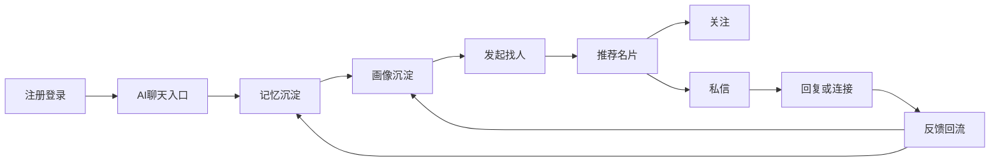

# OneLink Product System

## 1. 产品对象

### 1.1 用户角色
- `普通用户`：聊天、完善画像、发起找人、被他人发现、关注、私信、投诉。
- `高可信用户`：通过认证、资料质量、正向互动积累更高信任分。
- `审核与运营人员`：处理高风险工单、灰区处罚、申诉和规则更新。
- `企业用户`：在后续阶段开放，主要用于招聘、合作、组织内连接。

### 1.2 核心使用场景
- 情感社交：找到愿意交流、边界相容的人。
- 学习咨询：找到懂某领域、愿意提供帮助的人。
- 招聘与找工作：连接候选人、HR、顾问、导师。
- 商业合作：找到联合创始人、渠道方、供应商、投资人、客户。

## 2. 核心闭环

## 3. 功能系统

### 3.1 注册与登录
- 支持：
  - 用户名 + 密码
  - 邮箱 + 验证码
  - 手机号 + 验证码
  - OAuth：Google、GitHub、Apple、微信、抖音等
- 所有登录方式统一映射到一个 `OneLink User ID`。
- 同一用户允许绑定多个登录方式，但不允许默认生成多个画像孤岛。
- 注册阶段只采集完成基础账户建立所必需的信息，其余一律后置。

### 3.2 AI 好友聊天入口
- 用户登录后默认进入 AI 对话窗口。
- 聊天不是单纯客服，而是产品的主入口，承担四个职责：
  - 回应用户当前问题和情绪
  - 触发长期记忆沉淀与 working memory 更新
  - 通过记忆计算层间接推动用户画像事实更新
  - 自然地补充问题和问卷
  - 接收找人需求并发起推荐流程
- 产品内核不是“聊天窗口”本身，而是聊天背后的 `Context / Memory OS`：
  - AI 对话负责采集、回应和编排
  - `context-service` 负责决定什么值得被记住、什么时候被使用
- MVP 阶段同时接入结构化问卷系统：
  - 注册后进入基础画像建档流程
  - 题库中存在一组基础必填问题
  - AI 对话负责把必填问题自然嵌入会话，而不是只依赖冷启动表单
- 聊天支持：
  - 文本
  - 语音转文本
  - 图片辅助描述
  - 文件摘要能力（后续阶段）

### 3.3 个人主页
- 主页字段分为三层：
  - `公开层`：头像、昵称、简介、公开标签、语言、地区级位置
  - `推荐层`：仅在被推荐时按权限展示的能力标签、帮助类型、可联系时段
  - `私密层`：仅用于画像和推荐，不对其他用户公开
- 主页不是静态履历，而是用户授权 AI 生成、用户可编辑和可关闭的动态名片。
- 所有字段都必须带可见性设置。

### 3.4 被找中心
- 用户可以声明：
  - 希望被哪些人找到
  - 可以提供哪些帮助
  - 不希望被哪些类型的人打扰
  - 可响应的语言、时区和频率
- 被找中心本质上是“供给侧画像”的显示层。

### 3.5 基础问卷系统
- 问卷系统是 MVP 核心功能，不延后。
- 目标：
  - 快速建立用户基础画像
  - 在冷启动阶段提升推荐质量
  - 为后续动态追问和 1 万问题工厂打基础
- MVP 采用“双轨制”：
  - `基础画像题包`
    - 建立一组高价值基础问题，形成 MVP 的必填题包
    - 不建议在注册页一次性硬拦截 100 题，而是在注册后、首次找人前和使用过程中分批完成
  - `AI 自然追问`
    - 根据画像缺口在聊天中继续补充
- 设计原则：
  - 先完成最小高价值问题集，再逐步补齐完整基础题包
  - 问题完成度直接影响推荐质量和可用能力上限
  - 用户可以看到自己的完成进度，但不暴露内部评分逻辑

### 3.6 找人功能
- 输入方式：自然语言
- 示例：
  - “帮我找一个懂 AI 产品增长的人”
  - “我想认识愿意聊创业的技术合伙人”
- 找人流程：
  1. AI 理解用户意图
  2. 结合长期记忆、working memory 和画像摘要组装检索上下文
  3. 安全引擎审查请求
  4. 如有必要追问澄清
  5. 在候选池中召回和排序
  6. 返回名片卡片

### 3.7 推荐名片
- 默认名片字段：
  - 头像
  - 显示名
  - 一句话简介
  - 2 到 4 个关键标签
  - `关注` 按钮
  - `私信` 按钮
- 默认不展示：
  - 手机号
  - 邮箱
  - 精确地址
  - 真实身份敏感信息
- 推荐数量与账户等级、风险分、历史行为相关联。

### 3.8 关注系统
- 单向关注
- 关注列表在个人主页可见，但允许用户设置可见性
- 关注行为本身也是排序信号之一，但权重低于真正的互动结果

### 3.9 私信系统
- 陌生人默认只允许发送 1 条首条消息
- 只有在以下条件之一成立后，双方才进入正常会话：
  - 对方回复
  - 对方回关
  - 双方在某些授权场景下被明确连接
- 私信能力分阶段开放：
  - 阶段 1：文本
  - 阶段 2：图片、语音
  - 阶段 3：音视频通话、翻译

### 3.10 投诉与申诉
- 用户可投诉：
  - 找人请求
  - 推荐名片
  - 私信内容
  - 用户主页
- 每次投诉都生成工单并进入自动化判定链路。
- 被处罚用户必须拥有申诉入口，但高风险账号可以先处置再申诉。

### 3.11 情感陪伴
- AI 在聊天中识别以下高层情绪：
  - 开心
  - 低落
  - 焦虑
  - 愤怒
  - 迷茫
  - 进取
- 产品原则：
  - 可以共情和鼓励
  - 不做虚假医疗、法律、危机干预承诺
  - 涉及自伤、暴力或违法风险时，切换到安全引导流程

## 4. 产品关键规则

### 4.1 OneLink 不做什么
- 不做全网人肉搜索
- 不做“帮你定位某个现实世界特定个人”的隐私追踪工具
- 不以 AI 推断结果替代用户授权事实
- 不为了推荐效果放开骚扰、广告轰炸和黑灰产连接

### 4.2 OneLink 优先做什么
- 提升画像质量
- 提升推荐准确率和回复率
- 保护被找者的边界
- 让连接更像“受信任的引荐”，而不是“开放式骚扰”

## 5. 会员与商业化原则

### 5.1 会员分层
- `Free`
  - 有基础聊天
  - 有限推荐次数与推荐数
  - 标准匹配速度
- `Pro`
  - 更多推荐次数
  - 更高推荐上限
  - 更细的筛选与画像洞察
- `Business`
  - 团队管理
  - 组织主页
  - 企业级搜索与合规工具

### 5.2 商业化边界
- 不售卖个人隐私数据
- 不向广告主暴露可识别个人信息
- 所有商业能力都要让用户知道自己的哪些信息可能被用于推荐或商业场景

## 6. 核心 KPI

### 6.1 北极星指标
- `有效连接率`
  - 定义：推荐后在限定周期内形成双向回应的占比

### 6.2 关键支撑指标
- 找人成功率
- 推荐点击率
- 关注率
- 私信发起率
- 私信回复率
- 举报率
- 首月留存
- 问卷完成率和问题有效率

## 7. MVP 范围

### 7.1 必做
- 注册登录
- AI 聊天入口
- 基础画像题包
- 结构化问卷投放与作答
- 基础主页
- 基础画像
- 找人请求
- 风险审查
- 推荐名片
- 关注
- 陌生人单条私信
- 基础投诉

### 7.2 延后
- 音视频
- 复杂企业组织功能
- 直播
- 多角色内容生态
- 高级认证体系

## 8. 产品决策口径
- 所有新功能必须回答：它是让用户更好地“理解自己、被看见、找到合适的人”，还是只是增加复杂度？
- 若一个功能不能显著提升连接质量、回复率、安全性或留存，则不进入核心优先级。
