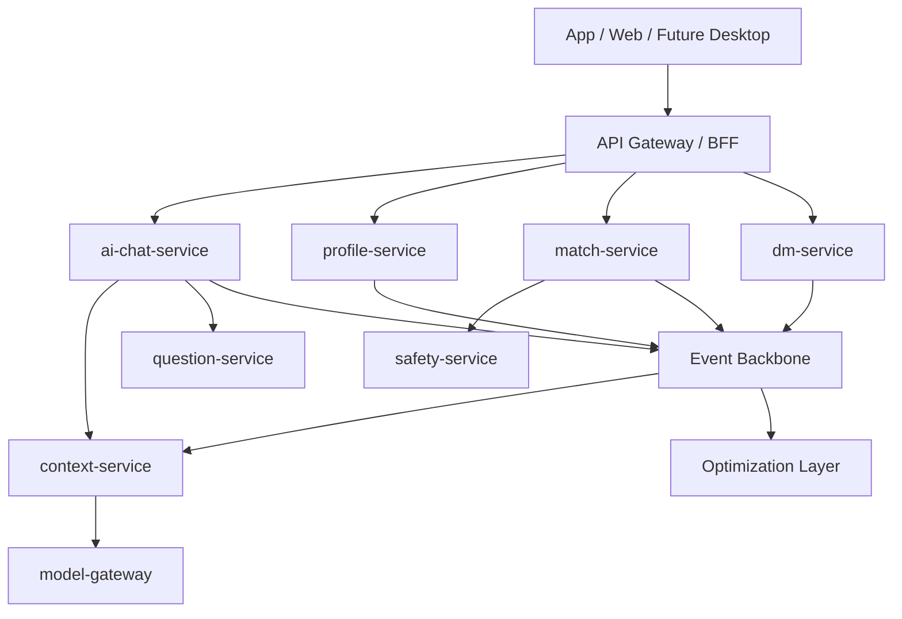

# System Architecture

## 1. 技术栈结论

- 在线核心服务：Rust。
- 辅助服务和平台工具：Go。
- AI 实验、训练、评估、离线分析：Python。
- Web：React + TypeScript。
- App：跨端优先；框架候选为 Flutter、React Native、KMP + Compose Multiplatform 或原生双栈，必须在 Phase 1 结束、Phase 2A 启动前定案，并共享 API、设计系统和埋点协议。
- 数据底座：PostgreSQL、Redis、Kafka 或兼容事件总线、对象存储、向量索引、后续图数据库或 Postgres 图扩展。

## 2. 总体分层

## 3. 数据平面与控制平面

数据平面处理真实用户请求：`api-gateway`、`bff`、`identity-service`、`ai-chat-service`、`context-service`、`profile-service`、`question-service`、`match-service`、`dm-service`、`safety-service`、`model-gateway`。

控制平面负责策略和实验：AutoResearch、Policy Config Store、Experiment Runner、Replay、Shadow、Canary、Rollback。

控制平面只能通过配置影响数据平面，不能直接改代码、表结构、事件 schema 或人格宪法。

## 4. 高并发架构原则

- Rust 服务默认无共享可变全局状态，关键状态必须持久化或外置到可扩展存储。
- 所有主链路接口必须有超时、限流、熔断、降级和 trace id。
- 模型调用必须经 `model-gateway`，按 chat、match、safety 等能力做舱壁隔离。
- 事件写入与异步消费者必须幂等，可重放，可观察。
- 热路径优先少服务跳转，复杂演化通过异步事件补偿。

## 5. 从 0327 资料吸收的架构升级

以下能力吸收自 `docs/0327` 的研究资料。除已明确写入服务边界、契约和工程门禁的内容外，均视为候选架构方向；在 owner、数据模型、契约与测试基线明确前，不视为冻结要求。

### 5.1 Context 分层再编译

状态：冻结为架构原则，已部分落地于 `context-service` 的 context build 路径；具体检索策略、token budget 和降级策略仍以 contract、实现和测试为准。

上下文不做全量拼接，而是拆成不变层、可变层、再编译层。`context-service` 根据任务、预算、用户状态和检索模式生成最小上下文包。

### 5.2 Skill 自动沉淀

状态：候选能力，Phase 3+ 预研方向。

Skill 不是人工整理的工具清单，而是从成功轨迹中抽象出来的可复用路径：使用轨迹 -> 脱敏泛化 -> 沙箱验证 -> 版本化发布 -> 灰度复用。

### 5.3 图谱 + 向量并存

状态：冻结为架构原则，尚未冻结完整图谱 schema 与查询契约。

找人和关系推理优先使用结构化条件、关系图和规则过滤。向量检索用于长文本、简介、对话片段和语义补充，不作为所有决策的唯一主路径。

### 5.4 提示词防火墙

状态：候选能力，当前冻结为“应建设前置护栏”的方向，不等于已完成具体实现与部署形态。

在昂贵模型调用前增加低成本 Prompt Gateway：规则过滤、语义过滤、格式校验、重复请求缓存和攻击拦截。该能力优先用 Rust 实现或集成，作为 API Gateway / model-gateway 的前置护栏。

## 6. 当前工程收口方向

审计显示 `repo/` 已有 11 个 Rust 服务骨架，但只有部分具备真实业务行为。下一阶段必须先把核心纵切面产品化，再扩展外围服务。

## 7. Model Gateway 成本与降级原则

`model-gateway` 是所有昂贵模型调用的唯一在线入口，必须同时承担路由、成本、可靠性和审计职责：

- 按能力域隔离连接池、预算和熔断：chat、context、match、safety、question 不得共享不可控预算池。
- 支持 provider-level fallback：主 provider 超时、限流、成本异常或安全策略失败时，必须能降级到备用 provider、小模型、缓存或澄清式回复。
- 输出成本指标：至少包含 per-conversation token、per-successful-connection cost、cache hit rate、provider error rate、fallback rate。
- Prompt Gateway、缓存和自托管小模型优先承接高频分类、过滤、压缩、格式校验和重复请求，不让低价值请求进入昂贵主模型。
- AutoResearch 可以优化预算阈值和路由权重，但不得绕过 `model-gateway` 的预算、审计、熔断和人工回滚门禁。

容量、SLO 和压测门禁见 `rules/12-CAPACITY-AND-SLO.md`。
