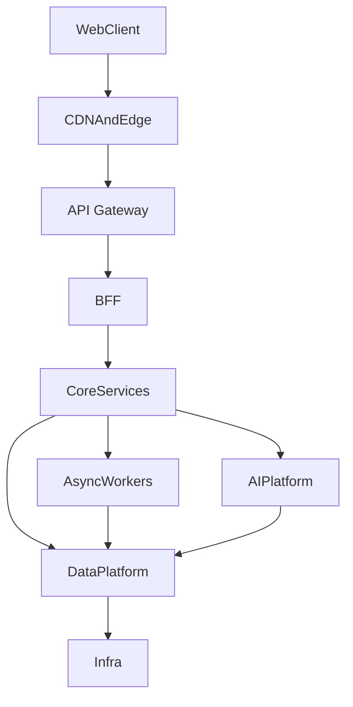

# OneLink Tech Architecture

## 1. 架构目标
- 在 MVP 阶段快速上线核心闭环
- 在百万到亿级 DAU 过程中保持服务可拆分、模型可替换、数据可迁移
- 在全球化阶段支持多区域部署、数据驻留与可审计治理

## 2. 技术主栈

### 2.1 语言分工
- `React + TypeScript`
  - Web 客户端
  - 管理后台
  - 设计系统与 BFF 对接
- `Rust`
  - MVP 阶段默认后端主语言
  - API Gateway、BFF、Model Gateway、AI 对话、私信、匹配、风控、身份、画像、问卷等在线服务
  - 匹配、风控、实时链路中的低延迟组件
  - 高吞吐 API 核心服务
- `Go`
  - 非 MVP 核心链路的辅助服务
  - 平台集成、运维工具、边缘适配器
  - 后续如有明确收益，再承接少量通用服务
- `Python`
  - 模型训练
  - 特征工程
  - 实验与评估
  - 部分 AI 周边服务

### 2.2 为什么这样分工
- 前端生态和团队效率层面，`React + TypeScript` 是最稳妥主选。
- `Rust` 从 MVP 开始承担主要在线服务，目的是提前冻结长期边界，避免未来把 `model-gateway`、实时消息链路和高吞吐服务从 `Go` 迁往 `Rust` 的二次迁移成本。
- `Go` 不再作为 MVP 默认后端语言，而是保留给后续工具化和辅助型服务。
- `Python` 不进入高 QPS 在线主链路，只负责 AI 平台和离线智能。

## 3. 总体分层

## 4. 服务拆分

### 4.1 MVP 服务集合
- `api-gateway`
  - 统一入口
- `bff`
  - 面向 Web 的聚合层
- `identity-service`
  - 账户、登录、绑定、会话
- `profile-service`
  - 主页、可见性、被找设置
- `context-service`
  - 记忆计算层
  - 负责 memory extraction、memory distillation、context assembly
- `ai-chat-service`
  - AI 对话、会话编排、陪伴、结果融合
- `dm-service`
  - 用户对用户私信、线程、送达、已读
- `question-service`
  - 基础必填题包、动态投放、作答记录
- `match-service`
  - 找人请求、候选召回、排序结果
- `safety-service`
  - 风险识别、举报、处罚建议
- `model-gateway`
  - 外部和内部模型路由

### 4.2 规模化后新增
- `feature-service`
  - 特征抽取、向量更新、画像摘要
- `ranking-service`
  - 两阶段召回与精排
- `trust-service`
  - 信任分、信誉事件、反滥用策略
- `notification-service`
  - 站内通知、邮件、短信、推送
- `review-console`
  - 审核工作台与申诉处理

## 5. 数据架构

### 5.1 主数据分层
- `Transactional Store`
  - 账户、关系、主页、会员、工单、配置
- `Event Backbone`
  - 聊天事件、记忆事件、问卷事件、推荐事件、举报事件、处罚事件
- `Feature Store`
  - 结构化事实、衍生特征、置信度、画像摘要
- `Memory Compute Store`
  - `memory_artifacts`
  - `memory_summaries`
  - `context_logs`
- `Vector Index`
  - 用户向量、问题向量、请求向量、memory artifact 向量
- `Object Store`
  - 头像、图片、语音、附件

### 5.2 技术选型原则
- MVP：
  - 事务主库：`PostgreSQL`
  - 缓存：`Redis`
  - 向量：`Qdrant`
  - 事件：`Kafka`
  - 对象：`S3 Compatible Storage`
- 成长期：
  - 保持业务接口不变
  - 按需要将向量索引升级到 `Qdrant` 或 `Milvus`
  - 将分析检索升级到 `OpenSearch`
- 多区域阶段：
  - 事务层迁移到更强的分布式或多区域方案
  - 但应用侧继续只依赖统一数据访问层，不直接写死底层数据库方言

### 5.3 不直接绑定死技术
- 不允许业务逻辑直接写入向量库专有语法。
- 不允许业务代码直接依赖某一个云厂商的独有 API。
- 所有底层存储通过服务层或仓储接口暴露。

## 6. 在线链路

### 6.1 聊天链路
1. 客户端请求到达网关
2. `bff` 聚合当前视图所需能力
3. `ai-chat-service` 校验会话与权限
4. `ai-chat-service` 调用 `context-service` 的 `/context/build`
5. `context-service` 读取 working memory、persistent memory、问卷状态和画像摘要，执行 token budget 控制与 task routing
6. `ai-chat-service` 调用 `model-gateway`
7. `ai-chat-service` 融合结果并返回 AI 回复
8. 同步写入 `chat.user_message.created.v1`
9. 异步触发记忆抽取、记忆压缩、画像投影、风险检测、问卷候选生成

### 6.2 找人链路
1. 用户发起找人请求
2. `safety-service` 先做规则与模型审查
3. 需要时向用户追问澄清
4. `match-service` 发起候选召回
5. MVP 阶段由 `match-service` 内部完成精排和多样性控制
6. 返回名片
7. 记录曝光、点击、关注、私信等反馈事件

### 6.3 问卷链路
1. 用户注册完成后进入基础画像建档流程
2. `question-service` 投放基础必填题包
3. 用户可在结构化问卷页或 AI 对话中作答
4. `question-service` 记录投放和作答事件
5. `context-service` 消费答案并生成记忆产物与摘要更新
6. `profile-service` 消费画像投影请求并更新事实层
7. `ai-chat-service` 根据剩余缺口继续自然追问

## 7. 实时与异步边界

### 7.1 实时链路
- 聊天回复
- `/context/build`
- 基础问卷投放
- 找人请求的风险判定
- 名片结果返回
- 首条私信发送

### 7.2 异步链路
- 记忆抽取
- 记忆压缩与 working memory 摘要更新
- 画像投影请求
- 深度画像更新
- 向量重算
- 问题生成和质量评估
- 排序实验与模型评估
- 批量风险回溯

## 8. IM 设计原则

### 8.1 MVP
- 文本消息优先
- WebSocket 维持连接
- 消息元数据与会话状态进入事务层
- 审核以服务端可见消息为基础

### 8.2 规模化
- 引入专用消息存储
- 引入离线消息同步与多端状态同步
- 如未来做更强隐私模式，必须先明确“哪些场景可做强加密，哪些场景仍需平台治理”

### 8.3 E2EE 立场
- 默认不在 MVP 中承诺全面端到端加密。
- 原因：OneLink 需要对陌生人私信和风险内容做平台治理。
- 后续如提供加密模式，只能在明确定义的低风险、已建立关系场景下局部开放。

## 9. 全球化架构

### 9.1 演进路线
- 单区域起步
- 双区域容灾
- 多区域就近接入
- 区域化数据驻留与统一调度

### 9.2 区域能力
- `Edge`
  - 静态资源加速
  - 请求限流
  - Bot 和 DDoS 初筛
- `Regional Control Plane`
  - 用户请求处理
  - 当地合规策略执行
  - 区域缓存和模型路由
- `Global Control Plane`
  - 配置管理
  - 指标与审计聚合
  - 全局模型与实验发布

## 10. 合规与数据驻留

### 10.1 基本原则
- 用户数据默认按注册区域或业务区域落地
- 敏感数据跨区域复制必须有业务必要性和合规依据
- 删除、导出、访问审计必须是平台级能力，而不是每个服务自己想办法

### 10.2 架构要求
- 账号主数据、消息、画像、处罚记录都必须带区域属性
- 模型调用和日志都要记录数据是否出域
- 管理后台必须能按区域检索和出具审计报告

## 11. 可观测性

### 11.1 标准三件套
- 指标：Prometheus 兼容
- 日志：结构化日志
- 链路追踪：OpenTelemetry

### 11.2 必须打点
- 模型请求成功率、延迟、成本
- `/context/build` 成功率、延迟、token 预算命中率
- 推荐主链路阶段耗时
- 风险拦截结果
- 投诉工单流转
- 画像更新失败率

## 12. 容量策略

### 12.1 扩展原则
- 所有在线服务优先无状态
- 所有耗时任务优先异步
- 所有热点结果优先缓存
- 所有模型调用优先路由和限流
- MVP 核心后端优先统一使用 `Rust`，避免主链路未来跨语言重构

### 12.2 关键容量对象
- 并发会话数
- working memory 缓存命中率
- 并发找人请求数
- 每日事件写入量
- 向量更新频率
- 审核工单量

## 13. 不可妥协的架构边界
- 禁止客户端直接调用外部模型 API
- 禁止业务服务绕过 `model-gateway`
- 禁止业务服务绕过 `context-service` 自行拼接长期记忆上下文
- 禁止在在线主链路做重型训练任务
- 禁止将模型供应商、数据库供应商、云厂商强绑定进业务代码
- 禁止未经过审计的跨区域数据复制
