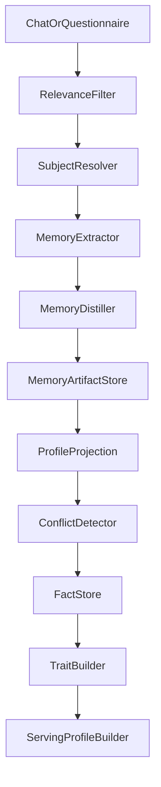

# OneLink AI Profile & Questionnaire

## 1. 文档目标
- 把“聊天上下文即画像”变成可实现的系统
- 把“1 万个问题”变成可扩展的问题工厂，而不是一堆静态题目
- 明确身份唯一性、无关信息过滤、矛盾处理和画像自我进化机制

## 2. 画像系统定义

### 2.1 画像不是一份静态简历
OneLink 画像由四层组成：
- `Raw Events`
  - 用户消息
  - 问卷作答
  - 点击、关注、私信、回复、举报等行为
- `Facts`
  - 从原始事件中提取的可追溯事实
- `Traits`
  - 由多个事实归纳出的稳定标签、分数、向量和关系
- `Serving Profile`
  - 给推荐、聊天、风险和主页展示使用的可服务版本

### 2.2 画像原则
- 只记录用户主动提供或平台内行为产生的信息
- 推断永远低于事实
- 所有画像字段都带时间、来源和置信度
- 用户可以查看、修正或关闭部分画像能力

### 2.3 画像前置：Memory Compute Layer
- OneLink 的聊天、问卷、行为信号不会直接无差别写入画像
- 所有长期理解能力先经过 `context-service`
- `context-service` 先产出：
  - `memory_summaries`
  - `memory_artifacts`
- `profile-service` 再决定哪些记忆投影进入画像事实层
- 这保证：
  - 原始对话 owner 清晰
  - 画像写路径单一
  - 记忆可压缩、可检索、可审计

## 3. 数据模型

### 3.1 Fact Schema
- `fact_type`
  - occupation
  - skill
  - interest
  - goal
  - boundary
  - language
  - timezone
  - availability
- `value`
- `source`
  - chat
  - questionnaire
  - behavior
  - explicit_edit
- `confidence`
- `effective_time`
- `captured_at`
- `status`
  - active
  - superseded
  - disputed
  - pending_confirmation

### 3.2 Trait Schema
- `trait_key`
- `trait_score`
- `supporting_facts`
- `model_version`
- `last_updated_at`

### 3.3 Serving Profile Schema
- public_summary
- searchable_tags
- support_offers
- connection_goals
- safety_flags
- match_embedding
- communication_preferences

### 3.4 Memory Summary Schema
- `summary_id`
- `user_id`
- `conversation_id`
- `summary_type`
  - working_memory
- `summary_text`
- `key_points_json`
- `source_message_range`
- `token_count`
- `updated_at`

### 3.5 Memory Artifact Schema
- `id`
- `user_id`
- `network_type`
  - world
  - experience
  - opinion
  - entity
- `evidence_type`
  - fact
  - inference
- `memory_level`
  - working
  - persistent
- `content`
- `content_structured`
- `source_type`
  - chat
  - questionnaire
  - behavior
- `source_service`
- `source_ref_id`
- `source_event_id`
- `entity_refs`
- `confidence`
- `importance_score`
- `consistency_score`
- `version`
- `superseded_by`
- `visibility`
- `vector_ref`
- `region`
- `expires_at`
- `created_at`
- `updated_at`

说明：
- 以上字段口径以 `11-DATA-EVENT-MODEL.md` 为权威数据基线
- `memory_artifacts` 是记忆单元，不直接等于 `profile_facts`
- 记忆经 `profile.memory_projection.requested.v1` 投影后，才进入画像事实层

## 4. 信息抽取管线

### 4.1 无关信息过滤
- 分类目标：
  - 是否与用户本人相关
  - 是否与当前找人目标相关
  - 是否只是普通闲聊
- 处理方式：
  - 与用户本人无关：仅保留对话上下文，不写入画像
  - 与用户本人弱相关：进入候选事实，低置信度
  - 与用户本人强相关：进入事实抽取

### 4.2 身份唯一性识别
- 一个账号默认只维护一个主画像
- 当检测到“我朋友”“我同事”“我弟弟”等他人主体时：
  - 标记为 `non_self_context`
  - 不进入用户主画像
  - 如其与当前需求强相关，可作为临时检索上下文使用
- 若用户长期为他人代聊，系统必须追问：
  - “这次是以你的身份建立画像，还是仅帮助别人发起找人？”

### 4.3 矛盾处理
- 矛盾类型：
  - 事实冲突
  - 时间冲突
  - 能力等级冲突
  - 边界和意愿冲突
- 处理规则：
  - 明显冲突进入 `pending_confirmation`
  - 未确认前不覆盖高置信旧事实
  - 用户明确确认后，新事实替换旧事实并保留历史版本

### 4.4 画像投影规则
- `context-service` 不直接写 `profile_*`
- 它只产出 `memory_artifact` 与 `profile.memory_projection.requested.v1`
- `profile-service` 收到投影请求后：
  - 决定是否落为 `profile_fact`
  - 决定是否重算 `trait`
  - 决定是否更新 `summary` 与 `embedding`
- 这样可以避免聊天服务、问卷服务、记忆服务各自维护一套画像事实

## 5. 画像维度

### 5.1 基础维度
- 语言
- 地区
- 时区
- 职业领域
- 教育与经历摘要

### 5.2 能力维度
- 技能标签
- 能力等级
- 可提供帮助类型
- 内容或服务偏好

### 5.3 需求维度
- 想找什么人
- 当前目标
- 期望关系类型
- 是否接受跨语言连接

### 5.4 社交维度
- 沟通风格
- 响应习惯
- 可联系时段
- 对陌生人连接的容忍度

### 5.5 安全维度
- 风险信号
- 举报历史
- 被投诉类型
- 平台信任分

## 6. 1 万问题系统

### 6.1 不是 1 万条死题
OneLink 的“1 万题”由三部分组成：
- `Dimension Schema`
  - 想了解哪些维度
- `Canonical Templates`
  - 高质量母题模板
- `Variants`
  - 由模板自动生成的场景化问题

### 6.2 题库结构
- 基础身份
- 专业技能
- 兴趣偏好
- 连接意图
- 边界与可联系性
- 价值观与风格
- 情境选择题
- 开放式补充题

### 6.3 MVP 问卷策略
- 问卷系统从 MVP 就进入主链路。
- MVP 不是只做“AI 自然追问”，而是同时建设：
  - `基础画像题包`
    - 用于冷启动和最低画像完整度保障
  - `AI 自然追问`
    - 用于在对话中继续补齐缺口
- 基础画像题包的设计原则：
  - 总题池可以达到约 100 题级别
  - 但不建议在注册时一次性硬拦截全部完成
  - 更合理的方式是分阶段必填：
    - 账户建立后完成最小启动题集
    - 首次找人前完成更高质量画像题集
    - 后续继续补齐完整基础题包
- 这样既保留基础画像密度，又不把冷启动转化率直接打穿

### 6.4 问题对象
- `question_id`
- `dimension`
- `subdimension`
- `style`
  - single_choice
  - multi_choice
  - scale
  - rank
  - open_text
- `sensitivity_level`
- `information_gain_estimate`
- `skip_rate`
- `complaint_rate`
- `last_reviewed_at`

## 7. 问题生成闭环

### 7.1 生成来源
- 人工定义的母题模板
- AI 生成的变体
- 根据画像缺口产生的动态追问

### 7.2 生成步骤
1. 定位画像缺口
2. 选择对应维度模板
3. 生成问题候选
4. 走安全审查
5. 走质量评估
6. 小流量试投放
7. 根据结果保留、改写或下线

### 7.3 质量指标
- 信息增益
- 跳过率
- 回答完成率
- 投诉率
- 对推荐效果提升的边际贡献

## 8. 问题安全审查

### 8.1 审查目标
- 不诱导违法
- 不过度索取隐私
- 不使用歧视性表述
- 不让用户产生明显不适

### 8.2 审查链路
- 规则层
  - 敏感词
  - 禁止主题
  - 地区合规规则
- 模型层
  - 语义风险评估
  - 偏见检测
  - 诱导性检测
- 人工层
  - 抽检高风险或高投诉问题

### 8.3 自我更新
- 被拦截和被投诉的问题进入负样本库
- 每周更新禁止模式
- 每轮训练优先学习新出现的违规模式

## 9. 画像自我进化

### 9.1 进化目标
- 提高画像完整度
- 提高画像准确度
- 提高画像对推荐结果的预测能力

### 9.2 反馈来源
- 用户主动纠错
- 找人后的点击和回复
- 私信成功率
- 举报和拉黑
- 问题完成率与跳过率

### 9.3 进化方式
- working memory 摘要迭代
- memory artifact 质量重估
- 维度权重重估
- 问题模板优化
- 事实抽取模型迭代
- 服务画像摘要重写
- 低价值维度下线

## 10. 在线与离线边界

### 10.1 在线
- `/context/build`
- 最新事实更新
- 轻量画像摘要更新
- 澄清问题触发

### 10.2 离线
- 记忆抽取与压缩
- artifact 去重与冲突修复
- 向量重算
- 大规模维度再训练
- 问题质量评估
- 新维度发现

## 11. 用户可见与可控能力

### 11.1 用户必须能做的事
- 查看公开摘要
- 编辑公开名片
- 关闭部分被找能力
- 修改错误事实
- 提交申诉或纠错

### 11.2 用户不需要直接暴露的内部层
- 风险标签
- 训练特征
- 实验分组
- 内部置信度细节

## 12. 最重要的约束
- 禁止把聊天内容原文无差别变成公开标签
- 禁止在未确认身份主体时写入高置信画像事实
- 禁止为了收集更多信息而牺牲用户体验和隐私边界
- 禁止将“模型猜测”当作“用户事实”
- 禁止绕过 `context-service` 直接把长期聊天记忆拼进模型
