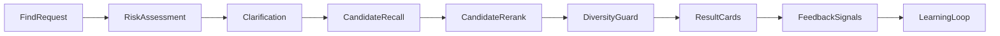

# OneLink Matching, Safety & Governance

## 1. 文档目标
- 定义找人请求如何从自然语言进入匹配系统
- 定义推荐召回、精排、多样性和反馈学习
- 定义自动化审核、投诉受理和处罚链路

## 2. 匹配系统总览

## 3. 找人请求理解

### 3.1 请求结构
- `goal`
  - 咨询
  - 合作
  - 求职
  - 招聘
  - 交友
  - 陪伴
- `target_traits`
  - 技能
  - 行业
  - 地区
  - 语言
  - 风格
- `constraints`
  - 时区
  - 是否接受跨语言
  - 是否接受远程
- `risk_signals`
  - 是否存在可疑意图

### 3.2 追问机制
- 当请求过于模糊时，系统优先澄清，而不是盲推。
- 示例：
  - “你是想找 AI 专家做学习咨询，还是找合作伙伴？”
- 澄清最多两轮，避免把找人变成复杂表单。

## 4. 召回与精排

### 4.1 召回层
召回阶段的目标是快速过滤掉不可能的候选人。

先做硬过滤：
- 是否允许被找
- 是否允许当前地区或语言用户联系
- 是否命中拉黑或风控限制
- 是否达到对方的频率限制
- 是否满足最基本技能或意图要求

再做召回：
- 标签召回
- 向量召回
- 行业和地区粗召回
- 历史响应倾向召回
- Phase 2 起引入 `context-service` 产出的长期记忆信号召回
  - 例如：长期兴趣、目标、关系偏好、沟通偏好

### 4.2 精排层
精排分数由以下因素构成：
- `need_fit`
  - 被找者是否真的能满足请求者的需求
- `offer_fit`
  - 被找者是否明确愿意提供该类帮助
- `intent_alignment`
  - 双方关系预期是否相容
- `response_likelihood`
  - 对方历史响应倾向
- `communication_compatibility`
  - 语言、风格、时区是否匹配
- `memory_alignment`
  - 基于 `context-service` 产出的长期记忆与当前找人意图的匹配度
  - MVP 先不进入主分数，Phase 2 起逐步引入
- `trust_score`
  - 风险低、信誉高、被投诉少

### 4.3 多样性约束
- 不允许推荐结果全都来自同一类人
- 不允许过度放大头部用户
- 同时考虑：
  - 技能多样性
  - 背景多样性
  - 新老用户平衡

## 5. 推荐结果策略

### 5.1 名片数策略
- `Free`
  - 较低推荐上限
- `Pro`
  - 更高推荐上限
- `Business`
  - 更高配额和更细规则

### 5.2 展示原则
- 展示最少必要信息
- 不直接暴露隐私联系方式
- 推荐理由要简短、可解释、不可泄露敏感画像

## 6. 反馈学习

### 6.1 关键反馈信号
- 曝光
- 点击
- 关注
- 私信发起
- 私信回复
- 拉黑
- 举报
- 长期关系维持

### 6.2 学习使用方式
- 召回权重更新
- 精排模型更新
- 被找意愿校正
- 低质量画像降权
- 高风险用户降权或冻结

## 7. 风险识别体系

### 7.1 风险对象
- 找人请求
- 私信内容
- 主页文本
- 举报工单
- 用户行为模式

### 7.2 风险等级
- `L0`
  - 正常
- `L1`
  - 边界模糊，需要追问
- `L2`
  - 中风险，限制部分能力
- `L3`
  - 高风险，拦截并进入审查
- `L4`
  - 极高风险，立即冻结或封禁

### 7.3 识别方法
- 规则引擎
- 小模型分类
- 大模型复核
- 行为异常检测
- 历史信誉和投诉记录

## 8. 风险场景

### 8.1 明确禁止
- 非法交易
- 骚扰或跟踪
- 人肉搜索
- 暴力和威胁
- 诈骗与诱导转账
- 明确侵犯隐私的精准定位需求

### 8.2 高风险灰区
- 高频群发陌生人消息
- 伪装身份
- 广告引流
- 过度营销
- 话术变种诈骗

### 8.3 处理原则
- 风险高于一定阈值，宁可延迟也不直接放行
- 灰区必须进入更强复核，而不是自动放过

## 9. 投诉系统

### 9.1 投诉入口
- 推荐名片投诉
- 私信投诉
- 主页投诉
- 行为投诉

### 9.2 工单结构
- reporter_id
- target_id
- object_type
- reason_code
- evidence
- auto_assessment
- final_decision
- appeal_status

### 9.3 自动处置流程
1. 接收投诉
2. 聚合上下文和证据
3. 规则和模型判定
4. 触发自动处罚或人工复核
5. 记录审计日志
6. 通知双方

## 10. 处罚体系

### 10.1 处罚阶梯
- 提醒
- 功能限流
- 推荐降权
- 陌生人私信禁用
- 短期禁言
- 冻结账号
- 永久封禁

### 10.2 处罚输入
- 风险等级
- 历史次数
- 行为严重性
- 是否存在欺诈或暴力意图
- 是否为首次轻度违规

### 10.3 处罚原则
- 可解释
- 可复审
- 可升级
- 对高危行为快速执行

## 11. 申诉机制

### 11.1 申诉入口
- 所有非极端高危处罚都提供申诉入口
- 申诉必须带明确信息补充

### 11.2 申诉处理
- 先自动复核
- 不明确则人工复核
- 复核结果必须写入审计日志

## 12. 治理与公平性

### 12.1 推荐公平性
- 不把曝光完全锁定在少数高活跃高头部用户
- 新用户和非头部用户要有合理探索流量
- 不因种族、性别、宗教等敏感特征进行不当排序

### 12.2 安全公平性
- 避免某些群体被系统性误伤
- 对所有自动处罚定期做偏差审查

## 13. 指标体系

### 13.1 匹配指标
- 召回率
- 精排点击率
- 回复率
- 有效连接率
- 长期复访率

### 13.2 安全指标
- 风险识别召回率
- 误伤率
- 举报确认率
- 申诉改判率
- 高危事件平均处置时长

## 14. 不可妥协的规则
- 禁止因为商业化而放宽高风险请求审查
- 禁止用未解释的黑箱处罚直接永久封禁普通灰区用户
- 禁止绕过投诉和审计链路私下修改处罚结果
- 禁止推荐逻辑泄露用户私密画像信息
