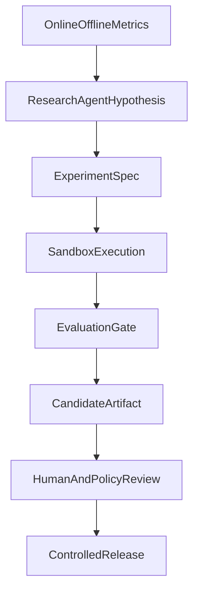

# OneLink Autoresearch & Paperclip Integration

## 1. 文档目标
- 明确 `karpathy/autoresearch` 与 `paperclipai/paperclip` 是否适合 OneLink
- 给出 OneLink 可执行的采用方式、接入位置和风险边界
- 明确哪些能力要借鉴，哪些不能直接照搬

## 2. 结论摘要

### 2.1 `karpathy/autoresearch`
- 采用方式：`局部借鉴`
- 适合领域：离线研究闭环、自动实验、模型和策略小步迭代
- 不适合领域：生产训练主干、用户在线链路、生产代码自动放权

### 2.2 `paperclipai/paperclip`
- 采用方式：`局部借鉴`，必要时可 `内网自托管试点`
- 适合领域：内部多 Agent 治理、预算控制、审批门禁、任务编排、审计追踪
- 不适合领域：用户侧产品核心架构、训练平台核心能力、线上高敏感业务的默认执行层

## 3. `autoresearch` 适合 OneLink 的地方

### 3.1 适合接入的任务
- 画像抽取模型的实验
- 风险分类器的超参数和样本策略实验
- 问题生成模板和质量评估策略实验
- 推荐排序特征组合和损失函数实验

### 3.2 OneLink 版改写思路
OneLink 不直接复制原项目，而是吸收它的“自动研究循环”：
1. 提出假设
2. 自动生成实验方案
3. 在隔离环境执行
4. 自动评估
5. 只把通过门禁的变更送入候选发布

### 3.3 OneLink Research Loop

## 4. `autoresearch` 不能直接照搬的地方
- 它原本是单 GPU、小训练窗口、研究导向，不是生产级多租户平台。
- 它默认允许智能体较自由地修改训练代码，这在 OneLink 的真实用户数据和生产环境中风险过高。
- 它没有天然解决数据驻留、审计、密钥管理、模型发布审批等企业级问题。

## 5. OneLink 对 `autoresearch` 的接法

### 5.1 接入层级
- 放在 `Research Cluster`
- 作为 `Training Platform` 的一个实验执行器
- 永远不直接接生产数据库写权限

### 5.2 数据权限
- 只能读取脱敏、分层后的研究数据集
- 只能写入实验产物和评估结果
- 不能直接改线上模型别名

### 5.3 发布门禁
- 必须经过离线评估
- 必须经过安全回归
- 必须经过灰度
- 必须可回滚

## 6. `paperclip` 适合 OneLink 的地方

### 6.1 适合接入的环节
- 内部 Agent 任务调度
- 需求分派
- 审批与预算
- 心跳式周期任务
- Agent 操作审计

### 6.2 可覆盖的内部流程
- 研发任务派发
- 安全巡检
- 数据质量巡检
- 模型评估周报
- 回归测试和发布检查

## 7. `paperclip` 不适合直接照搬的地方
- 它的核心叙事是“零人工公司控制面”，而 OneLink 是受监管、面向用户的高风险社交平台。
- 用户侧架构需要强业务边界和高可控性，不能把核心业务执行直接交给通用 Agent 编排平台。
- 它不能替代 OneLink 自己的模型平台、推荐服务、安全服务或事务系统。

## 8. OneLink 对 `paperclip` 的接法

### 8.1 推荐方式
- 仅在内部环境试点
- 作为 `Agent Control Plane`
- 专门管理非用户侧的 AI 团队工作流

### 8.2 适用 Agent
- PM Agent
- Research Agent
- QA Agent
- Security Agent
- DevOps Agent
- Documentation Agent

### 8.3 不允许接管的能力
- 用户消息主链路
- 推荐主链路
- 处罚最终执行权
- 生产数据库高权限改写
- 模型生产别名切换

## 9. 安全与治理要求

### 9.1 对 `autoresearch`
- 沙箱执行
- 只读基线代码
- 明确白名单目录
- GPU 配额
- 数据集版本固定
- 全量实验日志留档

### 9.2 对 `paperclip`
- 自托管部署
- 最小权限凭证
- 所有自动任务可暂停
- 所有预算可限制
- 所有关键任务需审批门禁

## 10. 成本要求

### 10.1 `autoresearch`
- 限定实验预算
- 限定并发实验数
- 限定单实验最长运行时间

### 10.2 `paperclip`
- 限定每个 Agent 月预算
- 限定高成本工具调用次数
- 对异常费用自动熔断

## 11. OneLink 推荐落地路线

### 11.1 第一步
- 不直接安装到主业务链路
- 先把两者的思想收敛成 OneLink 自己的治理边界

### 11.2 第二步
- 在内网或独立测试环境试点：
  - `autoresearch` 风格实验引擎
  - `paperclip` 风格 Agent 治理面板

### 11.3 第三步
- 只保留通过 OneLink 自己安全审查的部分进入正式平台
- 一切以 OneLink 的数据治理、发布门禁和合规规则为准

## 12. 最终建议
- `autoresearch`
  - 借鉴其自动实验闭环
  - 自己实现或包一层 OneLink Research Loop
- `paperclip`
  - 借鉴其多 Agent 组织、预算和审批思想
  - 只在内部研发治理试点使用

## 13. 不可妥协的原则
- 任何外部项目都不能反客为主成为 OneLink 的产品核心
- 任何自动化研究和 Agent 编排都不能绕过 OneLink 的安全、审计、预算和发布门禁
- 对用户侧高风险行为，最终解释权和治理规则属于 OneLink 自己的业务系统
