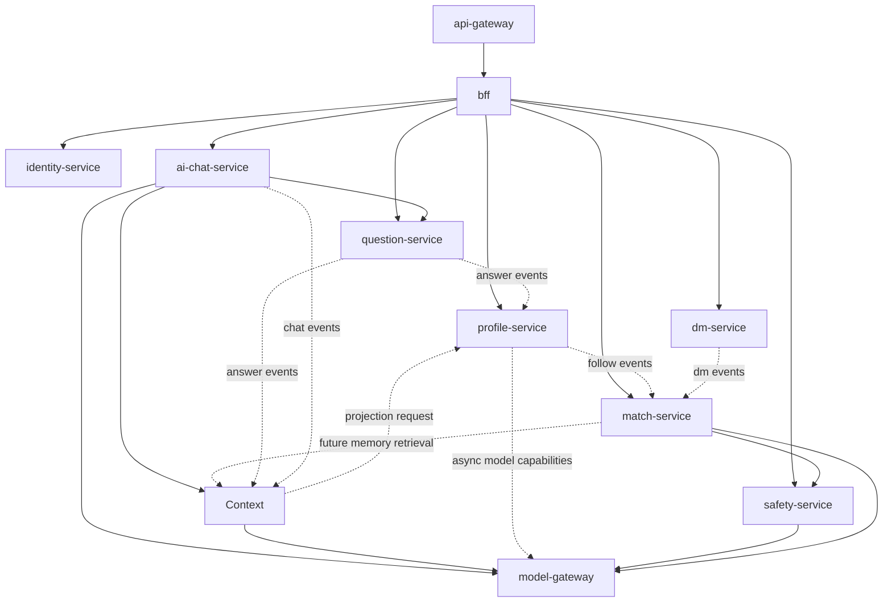

# OneLink Service Boundaries

## 1. 文档目标
- 定义 OneLink 第一版服务拆分清单
- 明确每个服务的主职责、拥有的数据、对外接口和依赖边界
- 防止团队出现“为了微服务而微服务”或“所有逻辑塞进一个服务”的两种极端

## 2. 服务拆分原则
- 一服务一主责
- 一类主数据只允许一个拥有者
- 读可以跨服务，写必须通过拥有者服务
- 在线主链路服务越少越好，异步能力后置拆分
- MVP 先保持少量核心服务，后期再分裂

## 3. MVP 推荐服务集合

### 3.1 `api-gateway`
- 语言：`Rust`
- 职责：
  - 统一接入
  - 路由
  - 限流
  - 鉴权入口
  - 请求日志和 trace 注入
  - MVP 阶段承接轻量接口聚合
- 不负责：
  - 业务编排
  - 领域逻辑

### 3.2 `bff`
- 语言：`Rust`
- 职责：
  - 为 Web 前端聚合接口
  - 减少前端直接调用多个后端服务
  - 做轻量视图组装
- 阶段策略：
  - 作为 MVP 正式服务进入主链路
  - 设计上保持“薄 BFF”，只做视图聚合、前端编排和客户端友好接口
  - 不承载领域主写路径和长期状态
- 不负责：
  - 核心业务规则
  - 长期数据存储

### 3.3 `identity-service`
- 语言：`Rust`
- 职责：
  - 账号注册登录
  - 绑定邮箱手机号 OAuth
  - 会话和令牌
  - 权限基础数据
- 拥有的数据：
  - users
  - identities
  - sessions
  - verification records

### 3.4 `profile-service`
- 语言：`Rust`
- 职责：
  - 主页字段
  - 可见性设置
  - 被找设置
  - 用户可编辑画像字段
  - 关注关系
  - 画像事实、特征、摘要、向量的最终写入
  - 画像事实冲突检测与版本流转
- 拥有的数据：
  - profiles
  - visibility settings
  - discovery preferences
  - follows
  - profile facts
  - profile fact revisions
  - profile traits
  - profile summaries
  - profile embeddings
  - trait supporting facts
- 写入约束：
  - 所有 `profile_*` 写入统一走 `profile-service`
  - AI 抽取、用户编辑、问题回答、冲突确认都不允许绕过 `profile-service` 直写画像表
  - `profile-service` 提供内部 `UpsertFact` 能力，统一处理乐观锁、冲突检测、审计和事件发射

### 3.5 `context-service`
- 语言：`Rust`
- 职责：
  - 记忆抽取
  - 记忆压缩
  - 上下文组装
  - working memory / persistent memory 的检索与排序
  - token budget 控制
  - 内嵌 `task-router` 逻辑组件
- 拥有的数据：
  - memory summaries
  - memory artifacts
  - context logs
  - `memory_artifacts.vector_ref` 指向的向量索引引用
- 写入约束：
  - 只拥有记忆计算层相关数据
  - 不拥有原始聊天、问卷答案、画像主表、推荐主表
  - 只通过 `profile.memory_projection.requested.v1` 发起画像投影，不直写 `profile_*`
  - 不允许把 `context-service` 与 `model-gateway` 混成一个超级服务

### 3.6 `ai-chat-service`
- 语言：`Rust`
- 职责：
  - AI 聊天会话
  - 用户消息
  - AI 回复记录
  - 陪伴对话
  - 调用 `context-service` 获取上下文包
  - 问卷自然追问编排
  - 结果融合与回复回写
- 拥有的数据：
  - ai conversations
  - ai messages
  - ai message contents
- 结构约束：
  - 作为独立服务进入 MVP
  - 不承担用户对用户 IM 写路径
  - 不承担长期记忆存储和上下文排序主逻辑
  - 与 `context-service`、`question-service`、`profile-service` 一起构成冷启动画像主链路

### 3.7 `dm-service`
- 语言：`Rust`
- 职责：
  - 用户对用户私信线程
  - 陌生人首条消息限制
  - 参与者状态
  - 送达和已读状态
- 拥有的数据：
  - direct message threads
  - dm participants
  - dm messages
  - delivery states
- 结构约束：
  - 作为独立服务进入 MVP
  - 不承担 AI 对话上下文和画像抽取逻辑
  - 后续扩展多端同步、离线消息、音视频邀请时继续沿该边界演进

### 3.8 `question-service`
- 语言：`Rust`
- 职责：
  - 基础必填题包
  - 动态问题投放
  - 问题模板与变体
  - 作答记录与完成度
  - 问卷完成度门槛控制
- 拥有的数据：
  - question templates
  - question variants
  - question deliveries
  - question answers
  - question quality metrics
- MVP 策略：
  - 作为 MVP 正式服务进入主链路
  - 支持基础结构化问卷和 AI 会话中的自然追问协同
  - 不要求注册页一次性完成全部基础题包，而是支持分阶段必填

### 3.9 `match-service`
- 语言：`Rust`
- 职责：
  - 接收找人请求
  - 编排召回与精排
  - 产出推荐名片结果
  - 汇总推荐反馈热数据
- 拥有的数据：
  - find requests
  - recommendation result sets
  - recommendation cards
  - recommendation feedbacks
- 写入约束：
  - `recommendation_feedbacks` 只允许 `match-service` 写
  - 其他服务只发领域事件，不直接写反馈表
  - `match-service` 通过异步消费者把 follow、dm_start、report 等跨域反馈归并到推荐反馈层
- MVP 排序信号：
  - MVP 不引入独立 `trust-service`
  - `trust_score` 在 MVP 只作为 `safety-service` 输出的轻量风险/信誉信号使用
  - Phase 3 再演进为独立信任快照和专属服务

### 3.10 `safety-service`
- 语言：`Rust`
- 职责：
  - 请求审查
  - 私信审查
  - 主页和画像回溯审查
  - 举报工单自动判定
  - 处罚建议
- 拥有的数据：
  - risk assessments
  - reports
  - moderation actions
  - appeals
  - user blocks
- 调用模式：
  - 同步调用：找人请求风险评估、陌生人首条私信审核
  - 异步调用：资料变更后的回溯审查、已入库消息的批量回扫

### 3.11 `model-gateway`
- 语言：`Rust`
- 职责：
  - 模型路由
  - Prompt 版本管理
  - 缓存
  - 审计
  - 成本计量
  - 按能力隔离连接池、限流桶和熔断器
  - 提供统一降级策略
- 拥有的数据：
  - model invocation logs
  - prompt versions
  - provider configs
- 可用性约束：
  - `chat`、`match`、`safety` 三类能力必须做舱壁隔离
  - 每类能力必须有独立熔断器
  - `safety-service` 在模型不可用时必须能退回规则兜底
  - `ai-chat-service` 在模型不可用时必须能退回受控降级回复
- 演进策略：
  - MVP 直接使用 `Rust`
  - 后续只允许升级内部实现，不允许改变上游能力接口

## 4. 成长期新增服务

### 4.1 `ranking-service`
- 从 `match-service` 中拆出
- 负责独立召回、精排、多样性控制

### 4.2 `trust-service`
- 管理信誉分、关系质量分、风险历史摘要
- 只通过事件消费安全历史和关系历史
- 不与 `safety-service` 建立双向同步调用

### 4.3 `notification-service`
- 管理站内通知、邮件、短信和推送

### 4.4 `media-service`
- 管理头像、图片、语音等对象媒体的元数据

### 4.5 `payment-service`
- 管理会员、额度、计费和支付回调

## 5. 平台侧服务

### 5.1 `event-backbone`
- 不一定作为单独业务服务暴露
- 但必须有独立治理
- 负责事件写入标准、投递和回放

### 5.2 `feature-service`
- 画像事实、向量、摘要的衍生层
- 更多偏平台和数据服务，不建议 MVP 过早拆出来

### 5.3 `review-console`
- 审核控制台
- 提供给运营和风控团队使用

## 6. 服务间调用关系

## 7. 数据拥有权

### 7.1 账号数据
- 只允许 `identity-service` 写

### 7.2 主页与被找设置
- 只允许 `profile-service` 写
- 关注关系和所有 `profile_*` 衍生层也只允许 `profile-service` 写

### 7.3 聊天与私信
- AI 对话只允许 `ai-chat-service` 写
- 用户私信只允许 `dm-service` 写

### 7.4 问卷数据
- 只允许 `question-service` 写

### 7.5 推荐结果与请求
- 只允许 `match-service` 写
- 推荐反馈热数据也只允许 `match-service` 写

### 7.6 风险与处罚
- 只允许 `safety-service` 写
- 用户拉黑关系也只允许 `safety-service` 写

### 7.7 模型调用日志
- 只允许 `model-gateway` 写

### 7.8 记忆计算层数据
- 只允许 `context-service` 写
- `memory_summaries`、`memory_artifacts`、`context_logs` 都不得由业务服务直写

## 8. 接口边界

### 8.1 同步接口适合做什么
- 用户前台查询
- 轻量业务校验
- 主链路返回结果

### 8.2 异步事件适合做什么
- 记忆抽取
- 记忆压缩
- 画像更新
- 向量重算
- 审核后处理
- 通知派发
- 统计和特征生成
- 推荐反馈归并
- trust 快照更新

## 9. 不建议的服务拆分
- 不要一开始就把 `context-service` 再拆成“聊天上下文摘要服务”“记忆向量服务”“画像投影服务”三个在线服务
- 不要一开始就把“召回服务”和“精排服务”拆太细
- 不要把 `model-gateway` 拆成多个供应商服务

## 10. MVP 到 Phase 2 的拆分节奏

### 10.1 MVP
- `api-gateway`
- `bff`
- `identity-service`
- `profile-service`
- `context-service`
- `ai-chat-service`
- `dm-service`
- `question-service`
- `match-service`
- `safety-service`
- `model-gateway`

### 10.2 Phase 2
- 增加 `notification-service`
- 拆分 `ranking-service`
- 扩大 `question-service` 的题库和试投放能力

### 10.3 Phase 3
- 增加 `trust-service`
- 增加 `payment-service`
- 增加 `media-service`
- 增加更独立的数据平台服务

## 11. 每个服务都必须具备
- 健康检查
- 结构化日志
- 指标
- trace
- 鉴权
- 错误码规范
- 契约文档

## 12. 最容易出问题的边界

### 12.1 `ai-chat-service` 与 `profile-service`
- `ai-chat-service` 只负责 AI 对话和会话，不负责最终画像写入
- 画像更新统一通过异步事实管线进入 `profile-service`
- `chat.user_message.created.v1` 先进入 `context-service` 做记忆抽取与压缩，再通过画像投影请求进入 `profile-service`

### 12.1A `ai-chat-service` 与 `context-service`
- `ai-chat-service` 负责会话 owner 与结果融合
- `context-service` 负责长期记忆检索、working memory 读取和 token budget 控制
- `ai-chat-service` 不允许自己拼长期记忆上下文
- `context-service` 不允许自己存原始聊天正文

### 12.2 `question-service` 与 `profile-service`
- `question-service` 只负责题目、投放、作答和完成度
- 画像事实写入仍然统一归 `profile-service`
- 问卷答案先进入 `context-service` 形成记忆产物，再通过画像投影进入事实层，不允许 `question-service` 自己维护另一套画像库

### 12.3 `dm-service` 与 `safety-service`
- `dm-service` 不自己维护一套风控规则
- 首条陌生人私信和高风险消息统一依赖 `safety-service`

### 12.4 `match-service` 与 `safety-service`
- `match-service` 不自己维护一套风控规则
- 风险判断统一依赖 `safety-service`
- `match-service` 不直接写风险表，`safety-service` 不直接写推荐反馈表

### 12.5 `model-gateway` 与业务服务
- 业务服务只说“我要什么能力”
- `model-gateway` 决定用哪个模型、哪个 Prompt、是否缓存

### 12.6 `trust-service` 与 `safety-service`
- `trust-service` 只消费 `safety-service` 的历史事件，不同步反查
- `safety-service` 如需信任信号，只读取快照或缓存，不建立反向强依赖

### 12.7 一致性修复
- 画像异步链路必须具备重试、死信队列和定时修复任务
- `profile-service` 需要定期校验 facts、traits、embeddings、summaries 的版本一致性

## 13. 这一阶段后最适合谁接手
- 下一步最适合让 `Opus 4.6` 对本文件做一次服务边界和拆分节奏审查
- 它最应该检查：
  - 有没有拆得太早
  - 有没有服务职责重叠
  - 哪些写路径会形成耦合或未来瓶颈
