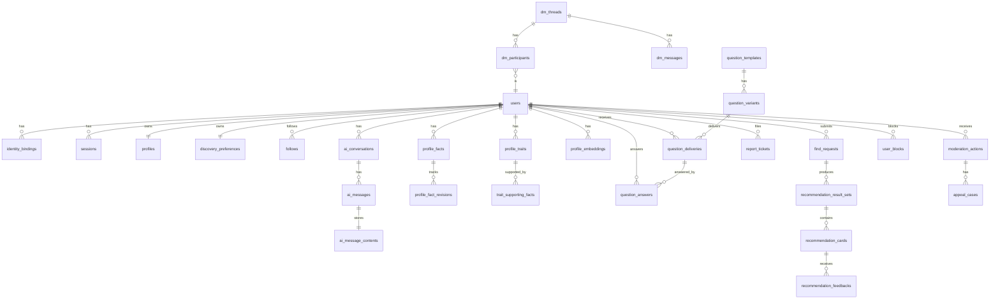

# OneLink Data & Event Model

## 1. 文档目标
- 定义 OneLink 第一版数据库模型草案
- 定义事件模型、命名规范和主链路事件流
- 为后续建表、事件 schema、埋点和训练数据治理提供统一基线

## 2. 总体原则
- 事务数据与事件数据分离
- 一类主数据只允许一个服务拥有写权限
- 所有关键对象既有事务表，也有对应事件流
- 所有 AI 关键动作必须能回放、审计和训练

## 3. 主体对象

### 3.1 账户域
- `user`
- `identity_binding`
- `session`
- `verification_attempt`

### 3.2 资料域
- `profile`
- `profile_visibility_rule`（MVP 先收敛到 `profiles` / `discovery_preferences` 字段，不独立建表）
- `discovery_preference`
- `user_boundary`（MVP 先通过 `user_blocks`、`moderation_actions` 等治理对象表达，不独立建表）
- `follow`

### 3.3 聊天与消息域
- `ai_conversation`
- `ai_message`
- `ai_message_content`
- `dm_thread`
- `dm_participant`
- `dm_message`

### 3.4 画像域
- `profile_fact`
- `profile_fact_revision`
- `profile_trait`
- `trait_supporting_fact`
- `profile_embedding`
- `profile_summary`

### 3.5 问题域
- `question_template`
- `question_variant`
- `question_delivery`
- `question_answer`
- `question_quality_metric`

### 3.6 匹配域
- `find_request`
- `find_request_clarification`（MVP 先作为 `find_requests.status` 与澄清 payload 表达，不独立建表）
- `candidate_recall_batch`
- `recommendation_result_set`
- `recommendation_card`
- `recommendation_feedback`

### 3.7 安全治理域
- `risk_assessment`
- `report_ticket`
- `moderation_action`
- `appeal_case`
- `user_block`
- `trust_score_snapshot`

### 3.8 上下文与记忆域
- `memory_summary`
- `memory_artifact`
- `memory_entity`
- `memory_entity_link`
- `agent_runtime_checkpoint`
- `forgetting_decision`
- `context_log`

### 3.9 模型平台域
- `model_invocation_log`

### 3.10 商业域
- `plan_subscription`
- `usage_quota`
- `payment_order`

## 4. 核心表草案

## 4.1 `users`
- `id`
- `status`
- `primary_region`
- `primary_language`
- `timezone`
- `created_at`
- `updated_at`

说明：
- 平台主用户 ID
- 不直接承载大量业务字段

## 4.2 `identity_bindings`
- `id`
- `user_id`
- `provider`
- `provider_subject`
- `email_or_phone_hash`
- `is_primary`
- `created_at`

说明：
- 统一绑定用户名密码、邮箱、手机号、OAuth

## 4.3 `sessions`
- `id`
- `user_id`
- `token_hash`
- `device_info`
- `ip_address`
- `expires_at`
- `created_at`

说明：
- 由 `identity-service` 拥有写权限
- 用于会话管理和安全审计

## 4.4 `verification_attempts`
- `id`
- `user_id`（nullable，注册前可能没有）
- `channel`
  - email
  - sms
- `target_hash`
- `code_hash`
- `status`
  - pending
  - verified
  - expired
  - failed
- `attempted_at`
- `verified_at`

说明：
- 由 `identity-service` 拥有写权限
- 支撑注册和绑定验证流程

## 4.5 `profiles`
- `user_id`
- `display_name`
- `avatar_url`
- `headline`
- `bio`
- `city_level_location`
- `languages`
- `is_searchable`
- `allow_discovery`
- `updated_at`

说明：
- 用户可见主页层

## 4.6 `discovery_preferences`
- `user_id`
- `can_be_found`
- `accepted_request_types`
- `accepted_languages`
- `accepted_regions`
- `max_intro_frequency_per_week`
- `allow_cross_language`
- `available_time_windows`
- `updated_at`

说明：
- 被找和边界配置

## 4.7 `follows`
- `id`
- `follower_user_id`
- `followee_user_id`
- `source`
  - recommendation
  - search
  - profile_visit
- `created_at`
- `unfollowed_at`

说明：
- 单向关注关系
- 由 `profile-service` 拥有写权限
- 既服务于社交展示，也服务于推荐反馈归因

## 4.8 `ai_conversations`
- `id`
- `user_id`
- `status`
- `last_message_at`
- `context_version`
- `created_at`

## 4.9 `ai_messages`
- `id`
- `conversation_id`
- `sender_type`
  - user
  - assistant
  - system
- `content_type`
- `created_at`

说明：
- 主表只保留高频查询所需的元数据
- 原始文本和大字段内容下沉到 `ai_message_contents`，通过 `ai_message_contents.message_id` 单向引用
- 不在主表存储 `content_ref_id`，避免双向外键写入风险
- SQL 细化阶段默认按时间分区设计

## 4.10 `ai_message_contents`
- `id`
- `message_id`
- `content_text`
- `content_metadata`
- `created_at`

说明：
- 承载原始消息正文和扩展元数据
- 便于冷热分层、归档和独立压缩

## 4.11 `dm_threads`
- `id`
- `thread_type`
  - stranger
  - connected
- `status`
- `created_at`

## 4.12 `dm_participants`
- `id`
- `thread_id`
- `user_id`
- `role`
  - initiator
  - recipient
- `status`
  - active
  - muted
  - left
- `last_read_message_id`
- `joined_at`
- `updated_at`

说明：
- 支撑"我的会话列表"、已读状态和后续多端同步

## 4.13 `dm_messages`
- `id`
- `thread_id`
- `sender_user_id`
- `content_type`
- `content_text`
- `review_status`
- `created_at`

## 4.14 `profile_facts`
- `id`
- `user_id`
- `fact_type`
- `fact_key`
- `fact_value_json`
- `source_type`
- `source_ref_id`
- `confidence`
- `status`
- `effective_time`
- `captured_at`

说明：
- 画像主事实表
- 所有标签和摘要最终都应能追溯到事实层
- 所有写入统一经由 `profile-service`
- SQL 细化阶段需要定义版本归档和分区策略

## 4.15 `profile_fact_revisions`
- `id`
- `fact_id`
- `previous_value_json`
- `previous_confidence`
- `previous_status`
- `changed_by`
  - system
  - user
  - model
- `changed_at`

说明：
- 每次 `profile_facts` 被更新时记录旧值快照
- 用于画像回溯、审计和矛盾修复
- 所有写入统一经由 `profile-service`
- SQL 细化阶段应定义归档策略（超过 N 个版本的旧 revision 归档）

## 4.16 `profile_traits`
- `id`
- `user_id`
- `trait_type`
- `trait_key`
- `trait_score`
- `model_version`
- `updated_at`

## 4.17 `trait_supporting_facts`
- `trait_id`
- `fact_id`
- `created_at`

说明：
- 用关联表替代 `supporting_fact_ids`
- 保持 trait 到事实层的可追溯关系

## 4.18 `profile_embeddings`
- `id`
- `user_id`
- `embedding_type`
  - match_profile
  - question_targeting
  - safety_context
- `vector_ref`
- `model_version`
- `source_fact_version`
- `updated_at`

## 4.19 `profile_summaries`
- `user_id`
- `public_summary`
- `internal_summary`
- `model_version`
- `source_fact_version`
- `updated_at`

## 4.20 `question_templates`
- `id`
- `dimension`
- `subdimension`
- `question_style`
- `template_text`
- `sensitivity_level`
- `status`
- `created_at`

## 4.21 `question_variants`
- `id`
- `template_id`
- `variant_text`
- `generation_source`
- `review_status`
- `created_at`

## 4.22 `question_deliveries`
- `id`
- `user_id`
- `variant_id`
- `delivery_channel`
  - onboarding_form
  - ai_chat
  - profile_completion
- `requirement_tier`
  - starter_required
  - profile_required
  - optional
- `status`
  - delivered
  - answered
  - skipped
  - expired
- `delivered_at`
- `answered_at`

说明：
- `variant_id` 指向 `question_variants.id`，从 variant 可回溯到 template
- 支撑基础必填题包和动态投放
- 问卷系统进入 MVP 后，该表属于主链路基础表

## 4.23 `question_answers`
- `id`
- `user_id`
- `variant_id`
- `delivery_id`
- `answer_payload`
- `answer_state`
  - answered
  - skipped
  - decline
- `answered_at`

说明：
- `variant_id` 指向 `question_variants.id`
- 只在用户实际提交答案后创建记录
- `question_deliveries.status` 的 `answered` 状态由 `question-service` 在收到 answer 后同步更新

## 4.24 `find_requests`
- `id`
- `user_id`
- `raw_query`
- `parsed_goal`
- `target_languages`
- `target_regions`
- `target_timezones`
- `allow_cross_language`
- `extra_constraints_json`
- `status`
  - pending
  - need_clarification
  - blocked
  - matched
- `risk_level`
- `created_at`

说明：
- 高频过滤与统计字段尽量列化
- 低频扩展约束保留在 `extra_constraints_json`

## 4.25 `recommendation_result_sets`
- `id`
- `find_request_id`
- `user_id`
- `ranking_version`
- `candidate_count`
- `served_at`

## 4.26 `recommendation_cards`
- `id`
- `result_set_id`
- `candidate_user_id`
- `rank_position`
- `score`
- `reason_summary`
- `served_at`

## 4.27 `recommendation_feedbacks`
- `id`
- `card_id`
- `actor_user_id`
- `source_event_id`
- `source_event_name`
- `feedback_type`
  - impression
  - click
  - follow
  - dm_start
  - dm_reply
  - dismiss
  - block
  - report
- `dismiss_reason`
- `created_at`

说明：
- 由 `match-service` 统一写入
- 其他服务只发领域事件，由推荐反馈归并消费者落表
- MVP 可先落在事务表，Phase 2 起逐步迁移到事件流与分析存储

## 4.28 `risk_assessments`
- `id`
- `target_type`
  - find_request
  - dm_message
  - profile
- `target_id`
- `risk_level`
- `risk_codes`
- `rule_version`
- `model_version`
- `decision`
- `created_at`

## 4.29 `report_tickets`
- `id`
- `reporter_user_id`
- `target_type`
- `target_id`
- `reason_code`
- `evidence_json`
- `status`
- `created_at`

## 4.30 `moderation_actions`
- `id`
- `target_user_id`
- `source_ticket_id`
- `action_type`
  - warn
  - throttle
  - mute
  - suspend
  - ban
- `duration_seconds`
- `reason_summary`
- `executed_at`

## 4.31 `appeal_cases`
- `id`
- `moderation_action_id`
- `user_id`
- `appeal_text`
- `status`
- `resolution_summary`
- `resolved_at`

## 4.32 `user_blocks`
- `id`
- `blocker_user_id`
- `blocked_user_id`
- `source`
  - manual
  - moderation
- `created_at`
- `released_at`

说明：
- 由 `safety-service` 拥有写权限
- 直接影响推荐召回、关注、私信权限

## 4.33 `model_invocation_logs`
- `id`
- `capability_name`
- `provider`
- `model_id`
- `prompt_version`
- `request_region`
- `latency_ms`
- `cost_estimate`
- `status`
- `trace_id`
- `created_at`

说明：
- 由 `model-gateway` 拥有写权限
- 用于审计、计费、降级分析和未来模型替换决策

## 4.34 `memory_summaries`
- `id`
- `user_id`
- `conversation_id`
- `summary_type`
- `summary_text`
- `key_points_json`
- `source_message_range`
- `token_count`
- `updated_at`

说明：
- 由 `context-service` 拥有写权限
- 作为 `working memory` 的持久化摘要层
- 不替代原始聊天正文，只承载压缩后的会话理解结果

## 4.35 `memory_artifacts`
- `id`
- `user_id`
- `network_type`
- `evidence_type`
- `memory_level`
  - working
  - persistent
- `content`
- `content_structured`
- `valid_from`
- `valid_until`
- `source_type`
  - chat
  - questionnaire
  - behavior
- `source_service`
- `source_ref_id`
- `source_event_id`
- `entity_refs`
- `confidence`
- `importance_score`
- `consistency_score`
- `version`
- `superseded_by`
- `visibility`
  - private
  - shared
  - safety_only
- `vector_ref`
- `region`
- `expires_at`
- `created_at`
- `updated_at`

说明：
- 由 `context-service` 拥有写权限
- 是长期理解用户的基础记忆单元
- 不等于画像事实，不直接替代 `profile_facts`
- 通过 `profile.memory_projection.requested.v1` 投影到画像层
- `network_type` 对齐 V2 四类认知网络：`world | experience | opinion | entity`
- `evidence_type` 区分直接事实与系统推断
- `version` 用于冲突检测、幂等更新和后续记忆重写追踪
- `superseded_by` 用于记录被更高置信度或更新记忆替代的演化链
- `expires_at` 用于 working 级或低价值记忆的 TTL 清理

## 4.36 `context_logs`
- `id`
- `user_id`
- `conversation_id`
- `input_ref_id`
- `selected_summary_ids`
- `selected_memory_ids`
- `task_type`
- `token_budget_json`
- `model_context_size`
- `created_at`

说明：
- 由 `context-service` 拥有写权限
- 用于审计上下文组装、回放与调优

## 4.36A `memory_entities`
- `id`
- `user_id`
- `entity_type`
- `name`
- `aliases`
- `attributes`
- `vector_ref`
- `created_at`
- `updated_at`

说明：
- 由 `context-service` 拥有写权限
- 存储人、公司、地点、主题、技能等实体主档案
- 为后续图扩展检索与关系推理提供基础

## 4.36B `memory_entity_links`
- `id`
- `user_id`
- `source_entity_id`
- `target_entity_id`
- `relation_type`
- `confidence`
- `evidence_artifact_id`
- `is_bidirectional`
- `created_at`

说明：
- 由 `context-service` 拥有写权限
- `is_bidirectional` 用于双向关系展开
- 每条关系都必须有证据溯源

## 4.36C `agent_runtime_checkpoints`
- `id`
- `agent_id`
- `user_id`
- `conversation_id`
- `schema_version`
- `working_summary_ref`
- `runtime_state_blob`
- `policy_versions_json`
- `created_at`

说明：
- 由 `context-service` 的会话域拥有写权限
- 支撑“逻辑 agent 常驻，运行时按需唤醒”
- `schema_version` 用于 checkpoint 向前兼容与自动迁移

## 4.36D `forgetting_decisions`
- `id`
- `user_id`
- `target_type`
- `target_id`
- `decision`
- `reason_codes`
- `policy_version`
- `cold_storage_ref`
- `created_at`

说明：
- 由 `context-service` 拥有写权限
- 记录选择性遗忘的审计轨迹
- 原文从热层移除后，仍必须保留冷存储引用

## 4.37 `trust_score_snapshots`
- `id`
- `user_id`
- `score`
- `score_version`
- `source_window`
- `updated_at`

说明：
- 不属于 MVP 必做表
- 在 Phase 3 随 `trust-service` 独立化后引入
- MVP 阶段由 `safety-service` 输出轻量风险/信誉信号供排序使用，不建立独立 trust 写路径

## 5. 主关系草图

## 6. 事件模型

## 6.1 命名规则
- 格式：`domain.entity.action.v1`
- 示例：
  - `identity.user.registered.v1`
  - `chat.ai_message.created.v1`
  - `profile.fact.upserted.v1`
  - `match.request.submitted.v1`

## 6.2 事件字段标准
- `event_id`
- `event_name`
- `event_version`
- `occurred_at`
- `producer`
- `trace_id`
- `region`
- `actor_user_id`
- `subject_id`
- `payload`

## 6.3 投递与一致性规则
- 投递语义默认 `at-least-once`
- 所有消费者必须按 `event_id` 做幂等处理
- 涉及用户主链路的事件优先使用 `actor_user_id` 或 `subject_user_id` 作为分区键
- 同一用户的事件要求在同一分区内保持业务顺序
- 业务时间以 `occurred_at` 为准，不以消费时间替代
- 需要回放的消费者必须能处理重复、延迟和乱序事件
- `context-service` 的 consolidation pipeline 从 MVP 起必须可重放，且以 `event_id` 作为修复与重跑的基础键

## 6.4 关键事件清单

### 6.4.1 账户域
- `identity.user.registered.v1`
- `identity.binding.added.v1`
- `identity.user.logged_in.v1`

### 6.4.2 聊天域
- `chat.ai_conversation.created.v1`
- `chat.user_message.created.v1`
- `chat.ai_message.created.v1`

### 6.4.3 私信域
- `dm.thread.created.v1`
- `dm.message.created.v1`
- `dm.message.reviewed.v1`

### 6.4.4 画像域
- `profile.profile.updated.v1`
- `profile.discovery_preference.updated.v1`
- `profile.visibility_rule.updated.v1`
- `profile.fact.extracted.v1`
- `profile.fact.upserted.v1`
- `profile.fact.conflict_detected.v1`
- `profile.trait.updated.v1`
- `profile.summary.updated.v1`
- `profile.embedding.updated.v1`

### 6.4.4A 上下文与记忆域
- `context.memory.extracted.v1`
- `context.memory.summary.updated.v1`
- `profile.memory_projection.requested.v1`

### 6.4.5 社交域
- `social.follow.created.v1`
- `social.follow.removed.v1`

### 6.4.6 问题域
- `question.delivery.created.v1`
- `question.variant.generated.v1`
- `question.variant.reviewed.v1`
- `question.delivered.v1`
- `question.answered.v1`
- `question.skipped.v1`

### 6.4.7 匹配域
- `match.request.submitted.v1`
- `match.request.blocked.v1`
- `match.clarification.required.v1`
- `match.result_set.served.v1`
- `match.card.impression_logged.v1`
- `match.card.clicked.v1`
- `match.card.dm_started.v1`
  - 事件名属于匹配反馈域，但实际生产者为 `dm-service`（线程创建成功后发出）
- `match.card.dismissed.v1`
- `match.card.reported.v1`

### 6.4.8 安全治理域
- `safety.assessment.completed.v1`
- `safety.user_block.created.v1`
- `moderation.report.created.v1`
- `moderation.action.executed.v1`
- `moderation.appeal.submitted.v1`
- `moderation.appeal.resolved.v1`

### 6.4.9 模型平台域
- `model.invocation.completed.v1`

## 7. 主链路事件流

### 7.1 问卷建档
1. `question.delivery.created.v1`
2. `question.delivered.v1`
3. `question.answered.v1`
4. `context.memory.extracted.v1`
5. `context.memory.summary.updated.v1`
6. `profile.memory_projection.requested.v1`
7. `profile.fact.upserted.v1`
8. `profile.trait.updated.v1`
9. `profile.embedding.updated.v1`

### 7.2 聊天更新画像
1. `chat.user_message.created.v1`
2. `context.memory.extracted.v1`
3. `context.memory.summary.updated.v1`
4. `profile.memory_projection.requested.v1`
5. `profile.fact.upserted.v1`
6. `profile.trait.updated.v1`
7. `profile.embedding.updated.v1`
8. `profile.summary.updated.v1`

### 7.3 找人推荐
1. `match.request.submitted.v1`
2. `safety.assessment.completed.v1`
3. `match.result_set.served.v1`
4. `match.card.impression_logged.v1`
5. `match.card.clicked.v1`
6. `social.follow.created.v1` 或 `match.card.dm_started.v1`
7. `dm.message.created.v1`
8. `match.card.reported.v1` 或 `dm.message.reviewed.v1`

### 7.4 投诉处罚
1. `moderation.report.created.v1`
2. `safety.assessment.completed.v1`
3. `moderation.action.executed.v1`
4. `moderation.appeal.submitted.v1`
5. `moderation.appeal.resolved.v1`

## 7.5 推荐反馈归并
1. `match.result_set.served.v1`
2. `match.card.impression_logged.v1`
3. `match.card.clicked.v1`
4. `social.follow.created.v1` / `dm.message.created.v1` / `match.card.reported.v1`
5. `match-service` 反馈归并消费者写入 `recommendation_feedbacks`

## 8. 训练与分析友好设计
- 所有推荐结果必须有曝光事件
- 所有 AI 生成问题必须有投放和作答事件
- 所有处罚必须有原始触发对象和最终决策
- 所有画像字段必须可回溯到事实层或用户编辑行为
- 推荐反馈必须保留来源事件，避免跨服务归因丢失
- 画像异步管线必须可根据 `source_fact_version` 检查 embeddings 和 summaries 是否滞后

## 9. 数据保留策略方向
- 原始消息与风险数据按合规要求分层保留
- 训练样本使用脱敏副本
- 公开名片数据和内部风险数据绝不混用
- 热表与归档层分离，消息与高频反馈在 SQL 细化阶段默认按冷热分层设计

## 10. MVP 优先实现表
- `users`
- `identity_bindings`
- `sessions`
- `verification_attempts`
- `profiles`
- `discovery_preferences`
- `follows`
- `ai_conversations`
- `ai_messages`
- `ai_message_contents`
- `dm_threads`
- `dm_participants`
- `dm_messages`
- `question_templates`
- `question_variants`
- `question_deliveries`
- `question_answers`
- `profile_facts`
- `profile_fact_revisions`
- `profile_traits`
- `trait_supporting_facts`
- `profile_summaries`
- `profile_embeddings`
- `memory_summaries`
- `memory_artifacts`
- `memory_entities`
- `memory_entity_links`
- `agent_runtime_checkpoints`
- `forgetting_decisions`
- `context_logs`
- `find_requests`
- `recommendation_result_sets`
- `recommendation_cards`
- `recommendation_feedbacks`
- `risk_assessments`
- `report_tickets`
- `moderation_actions`
- `appeal_cases`
- `user_blocks`
- `model_invocation_logs`

## 11. 不建议现在就做的复杂点
- 不要一开始就上超复杂图数据库主存
- 不要一开始就为每个画像子维度单独建几十张表
- 不要把所有埋点都做成无约束 JSON 黑盒
- 不要在 MVP 就把推荐反馈全量长期留在单一事务库里
- 不要让任何服务绕过事件语义和幂等约束直接拼接"伪事件"

## 12. 这一阶段后最适合谁接手
- 下一步最适合让 `Composer 1.5` 基于本文件把：
  - 建表 SQL 草案
  - OpenAPI 契约
  - 事件 schema JSON
  - 服务间接口草案
  继续细化出来
- 如果要先做高标准挑错，再让 `Opus 4.6` 先审一次主键、写路径和事件风暴风险
